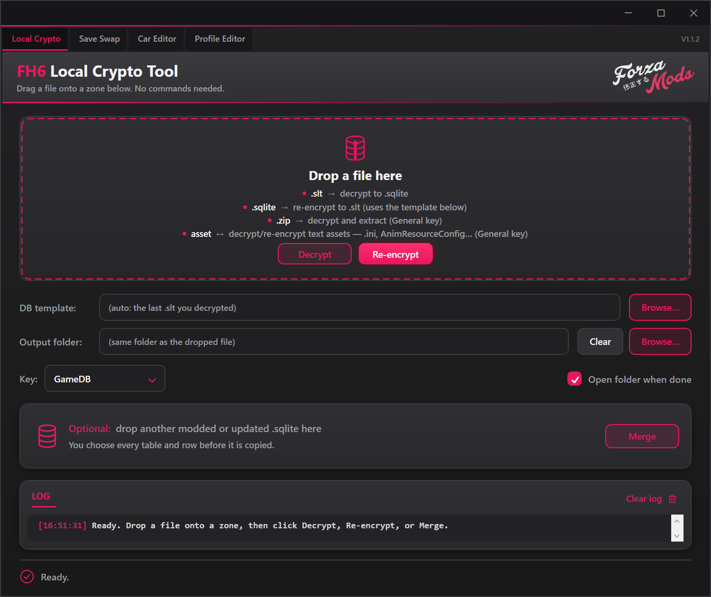
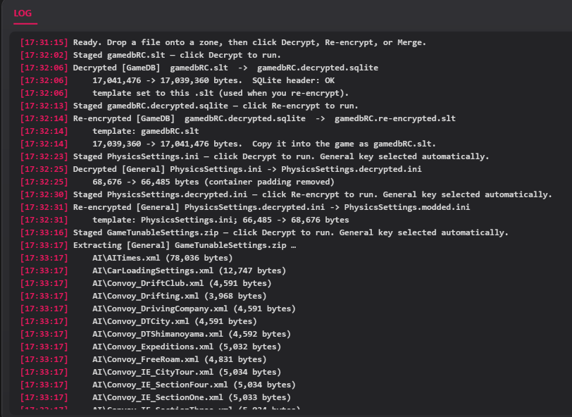
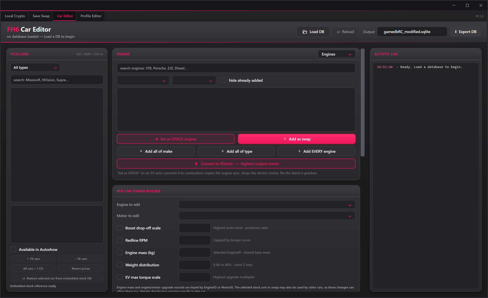
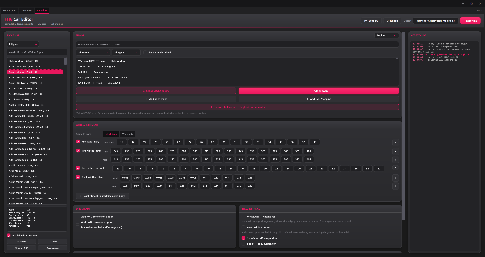
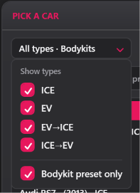
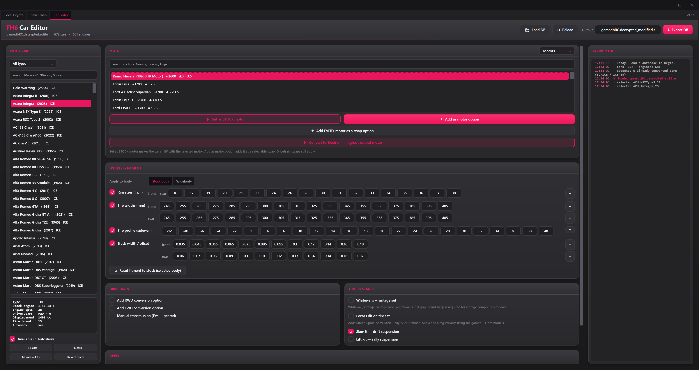
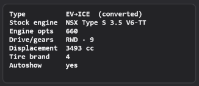
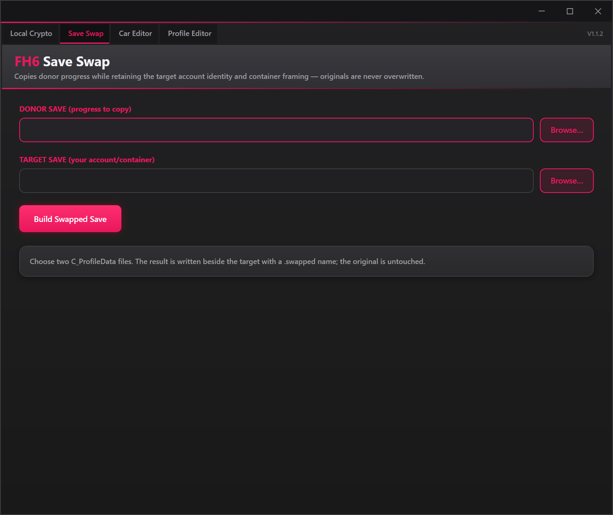

# FH6 Local Crypto Tool

FH6 Local Crypto Tool is a Windows desktop utility for decrypting and rebuilding supported FH6 files, creating ProfileData save swaps, and editing vehicle data in a decrypted GameDB.

## Table of contents

- [Features](#features)
- [Requirements](#requirements)
- [Before you begin](#before-you-begin)
- [Beginner overview](#start-here-a-beginners-guide)
- [Required GameDB folder setup](#required-gamedb-folder-setup)
- [Your first complete car edit](#your-first-complete-car-edit)
- [Which buttons require Apply?](#which-buttons-require-apply)
- [Output-name cheat sheet](#output-name-cheat-sheet)
- [Section 1: Local Crypto](#section-1-local-crypto)
- [Section 2: Car Editor](#section-2-car-editor)
- [Section 3: Save Swap](#section-3-save-swap)
- [Troubleshooting](#troubleshooting)
- [Advanced technical reference](#advanced-technical-reference)
- [Video guide](#video-guide)
- [Disclaimer](#disclaimer)
- [Credits](#credits)

## Features

- Decrypt and re-encrypt GameDB `.slt` containers.
- Decrypt, edit, and re-encrypt supported text assets such as INI, XML, JSON, TXT, and extensionless configuration files.
- Authenticate and extract encrypted ZIP entries.
- Merge SQLite databases or SQL overlays into a working GameDB.
- Edit car availability, prices, engines, motors, fitment, drivetrains, tires, suspension, and handling.
- Build ProfileData save swaps while retaining the target save's container framing and canonical account XUID.
- Create renamed output files without overwriting the input files.

## Requirements

The release executable is a self-contained Windows x64 application. It does not require a separate .NET installation.

Building the source requires Windows 10 or Windows 11 and the .NET 8 SDK.

## Before you begin

1. Close the game before replacing any game or save files.
2. Make a separate backup of every original file you intend to replace.
3. Keep the encrypted original beside edited output whenever possible. Re-encryption uses the original file as a framing template.
4. Work on copied files until you have confirmed the result in game.
5. Read the activity log after every operation. A completed file write does not necessarily mean the game accepted the edited contents.

> **Live SQLite Editor compatibility:** JXRDN has not tested how previously using a Live SQLite Editor may affect a database used with this tool. It is also unknown whether a `.sqlite` file created by a Live SQLite Editor can be safely merged into `gamedbRC.sqlite`. Keep untouched backups and do not assume the two editing workflows are compatible.

## Start here: a beginner's guide

Download `FH6LocalCryptoTool-v1.0.0-win-x64.exe` from the release assets and run it. The release is a portable application, so there is no installer.

The tool has three tabs:

| Tab | Use it when you want to... |
|---|---|
| **Local Crypto** | Decrypt or re-encrypt a GameDB or text asset, extract an encrypted ZIP, or merge database content. |
| **Car Editor** | Change cars, upgrades, prices, fitment, tires, suspension, drivetrains, engines, motors, or handling. |
| **Save Swap** | Move the progress payload from one `C_ProfileData` save into another save's container. |



### The most important concept

The GameDB has three stages:

1. `gamedbRC.slt` is the encrypted game file.
2. `gamedbRC.decrypted.sqlite` is the editable database created by this tool.
3. A `.re-encrypted.slt` file is the rebuilt game file created after editing.

The Car Editor cannot directly edit the encrypted `.slt`. First decrypt the SLT, edit and export the SQLite database, and then re-encrypt the exported SQLite database.

### Required GameDB folder setup

FH6 includes an original GameDB under `media\stripped`. Do not decrypt, edit, rename, or replace that original. Copy it into `MediaPC\stripped` and perform all GameDB work on the copy in `MediaPC`.

```text
<FH6 install>\media\stripped\gamedbRC.slt    Original source — leave untouched
<FH6 install>\MediaPC\stripped\gamedbRC.slt Working copy — decrypt and replace this one
```

Before copying, back up any `gamedbRC.slt` that already exists in `MediaPC\stripped`. It is also wise to keep an additional backup outside the game directory.

The `MediaPC\stripped` working folder might eventually contain:

```text
gamedbRC.slt                       Original encrypted template
gamedbRC.decrypted.sqlite          Decrypted database
gamedbRC_modified.sqlite           Database exported by Car Editor
gamedbRC_modified.re-encrypted.slt Rebuilt encrypted database
```

Never modify or delete the original under `media\stripped`. Use the copied `MediaPC\stripped\gamedbRC.slt` as the template when rebuilding your edited database.

## Your first complete car edit

This walkthrough covers the full process from the original game file to a rebuilt file. For your first test, make only one small and easy-to-recognize change.

### Part 0: leave the car you plan to modify

Before closing the game to begin your edit:

1. Switch out of every car you intend to modify.
2. Make an unrelated, unmodified car your currently active car.
3. Wait for the game to save the car change.
4. Close the game normally.

Do not close the game while sitting in a car you are about to change in the database. When the modified database is installed, the game may try to load that saved garage instance immediately with upgrade references that no longer match.

### Part 1: copy the original GameDB

1. Close the game.
2. Open the game's installation folder.
3. Open `media\stripped` and find the original `gamedbRC.slt`.
4. Copy, rather than move, that file.
5. Open `MediaPC\stripped` and paste the copied `gamedbRC.slt` there.
6. If `MediaPC\stripped\gamedbRC.slt` already exists, back it up before replacing it.
7. From this point onward, use only the copy under `MediaPC\stripped`. Leave `media\stripped\gamedbRC.slt` untouched.

### Part 2: decrypt the GameDB

1. Open FH6 Local Crypto Tool.
2. Select the **Local Crypto** tab.
3. Drag `MediaPC\stripped\gamedbRC.slt` into the large drop area. Do not drag the original from `media\stripped`.
4. Look at the staged-file text. It should identify an `.slt` ready to decrypt.
5. Click **Decrypt**.
6. Wait until the activity log reports `Decrypted OK` and confirms a valid SQLite header.
7. Find `gamedbRC.decrypted.sqlite` beside the copied SLT in `MediaPC\stripped`, unless you selected a different output folder.

Do not rename or remove the copied `MediaPC\stripped\gamedbRC.slt` yet. The tool remembers that copy as the re-encryption template for the current session. The source file under `media\stripped` remains untouched.

### Part 3: edit one car

1. Select the **Car Editor** tab.
2. Click **Load DB**.
3. Select `gamedbRC.decrypted.sqlite`.
4. Wait for the car list and database totals to appear.
5. Use the search box to find a car you own and can easily test.
6. Click the car once to select it.
7. Make one small change. For example, enable **Available in Autoshow** or add one sensible fitment option.
8. If you changed Wheels & Fitment, Drivetrain, or Tires & Stance, review every checked option and click **APPLY changes to this car**. Autoshow, engine, motor, price, and handling actions do not need this Apply button.
9. Read the activity log and confirm that the operation completed.
10. Click **Export DB**.
11. Save it with a new name such as `gamedbRC_modified.sqlite`.

The database originally loaded into Car Editor is not modified directly. Your changes are saved to the file created by **Export DB**.

### Part 4: re-encrypt the edited database

1. Return to **Local Crypto**.
2. Check the **DB template** field. It should point to the original `gamedbRC.slt` used earlier.
3. If it is empty or incorrect, click **Browse** beside **DB template** and select that original SLT.
4. Drag `gamedbRC_modified.sqlite` into the large drop area.
5. Confirm that the staged-file text identifies a SQLite database ready to re-encrypt.
6. Click **Re-encrypt**.
7. Wait for the success message in the activity log.
8. The new file will be named `gamedbRC_modified.re-encrypted.slt`.

### Part 5: test the rebuilt file

1. Make sure the game is closed.
2. Back up the current `MediaPC\stripped\gamedbRC.slt` somewhere safe.
3. Copy `gamedbRC_modified.re-encrypted.slt` into `MediaPC\stripped`.
4. Rename the copied file to `gamedbRC.slt` so the game recognizes it.
5. Start the game. It should load with the unrelated, unmodified car you selected before closing it.
6. Do not select an old garage copy of the car you modified.
7. Buy a fresh copy of the modified car from the Autoshow and build it again from stock.
8. Test only the database change you made.
9. If the game hangs, crashes, or behaves incorrectly, close it and restore the original backup.

Do not install the modified file into `media\stripped`. All edits and replacements belong in `MediaPC\stripped`.

Once this basic workflow succeeds, repeat it with additional edits. Testing a few changes at a time makes it much easier to identify an incompatible value.

## Which buttons require Apply?

This distinction is important:

- Checkbox-based fitment, drivetrain, tire, and stance options require **APPLY changes to this car**.
- Engine, motor, Autoshow, FE-car, global-price, and enhanced-handling buttons change the temporary working database immediately.
- Both kinds of changes still require **Export DB** before they exist in a new SQLite file.
- The exported SQLite must then be re-encrypted before the game can use it.

If a change does not appear in game, check this chain:

```text
Choose option → Apply if required → Export DB → Re-encrypt exported DB → Install rebuilt SLT
```

## Output-name cheat sheet

| Operation | Example input | Example output |
|---|---|---|
| Decrypt GameDB | `gamedbRC.slt` | `gamedbRC.decrypted.sqlite` |
| Re-encrypt GameDB | `gamedbRC_modified.sqlite` | `gamedbRC_modified.re-encrypted.slt` |
| Decrypt text asset | `PhysicsSettings.ini` | `PhysicsSettings.decrypted.ini` |
| Re-encrypt text asset | `PhysicsSettings.decrypted.ini` | `PhysicsSettings.modded.ini` |
| Extract encrypted ZIP | `Example.zip` | `Example.extracted` folder |
| Merge database | `gamedbRC.decrypted.sqlite` | `gamedbRC.decrypted.merged.sqlite` |
| Build save swap | target `C_ProfileData` | `C_ProfileData.swapped` |

The tool does not overwrite the original input during these operations.

## Section 1: Local Crypto

Use this section for encrypted GameDB files, supported text assets, encrypted ZIP extraction, and database merging. Local Crypto is also the first and last step of the Car Editor workflow: decrypt the GameDB before editing it, then re-encrypt the exported database afterward.

For GameDB work, always use the copied file at `MediaPC\stripped\gamedbRC.slt`. Keep the original `media\stripped\gamedbRC.slt` untouched.

### Decrypt a GameDB

1. Open **Local Crypto**.
2. Optionally choose an **Output folder**. Otherwise, output is written beside the dropped file.
3. Drag `gamedbRC.slt` onto the large drop area.
4. Confirm that the staged-file message identifies it as an SLT ready to decrypt. The appropriate GameDB method is selected automatically.
5. Click **Decrypt**.
6. Wait for `Decrypted OK` and check the log for a valid SQLite header.
7. The output is named `gamedbRC.decrypted.sqlite`.

The original SLT is retained and remembered as the DB template for the current session.

### Re-encrypt a GameDB

1. Start with a decrypted or edited SQLite database.
2. If you decrypted its original SLT in the same session, the template is already selected.
3. Otherwise, click **Browse** beside **DB template** and select the original matching `gamedbRC.slt`.
4. Drag the edited `.sqlite` onto the main drop area.
5. Confirm that it is staged as SQLite ready to re-encrypt.
6. Click **Re-encrypt**.
7. The output is named `<database-name>.re-encrypted.slt`.
8. Preserve the original game file, then copy and rename the rebuilt file only when ready to test.

Always use the original SLT from the same game build as the SQLite database being rebuilt.

### Decrypt an encrypted text asset

This workflow supports authenticated text containers such as `PhysicsSettings.ini`, XML, JSON, TXT, and extensionless configuration assets.

1. Drag the encrypted asset onto the main drop area.
2. The tool detects the container structure and selects the General method automatically.
3. Click **Decrypt**.
4. Confirm that the log reports plausible text output.
5. The output keeps the original extension and adds `.decrypted` before it. For example, `PhysicsSettings.ini` becomes `PhysicsSettings.decrypted.ini`.
6. Edit the decrypted copy with a text editor. Preserve its syntax, encoding, section names, and required delimiters.

### Re-encrypt an edited text asset

1. Keep the original encrypted asset available as the template.
2. Drag the edited decrypted text file onto the main drop area.
3. Click **Re-encrypt**.
4. If the original cannot be found automatically, select it when prompted.
5. The rebuilt output is written as `<asset-name>.modded<extension>`.
6. Check the log for a successful authenticated rebuild before testing it in game.

Do not use a different asset or a file from another game build as the template.

### Extract an encrypted ZIP

1. Drag the `.zip` onto the main drop area.
2. Confirm that the General method was selected automatically.
3. Click **Decrypt**.
4. Extracted files are written into `<zip-name>.extracted`.
5. Review the log for the authenticated entry count and total extracted size.

The current interface decrypts and extracts supported ZIP entries. It does not rebuild a modified outer ZIP archive.

### Local Crypto controls

- **DB template** selects the original SLT used to frame a rebuilt GameDB.
- **Output folder** overrides saving beside the input.
- **Clear** returns output to the input file's folder.
- **Key** allows manual method selection for advanced cases; normal GameDB, asset, and ZIP workflows select it automatically.
- **Open folder when done** opens the completed output's location.
- **Clear log** clears only the on-screen activity history.

The activity log confirms each staged, decrypted, re-encrypted, or extracted file:



## Section 2: Car Editor

Use this section after creating a decrypted `.sqlite` GameDB through Local Crypto. Car Editor works on a temporary copy, so remember to export the database and re-encrypt that exported file when finished.



### Important: prepare and replace modified cars safely

Before closing the game to install a database edit, switch to a car you are not modifying and wait for the game to save. Never leave your character sitting in the car whose database records you are changing.

After installing the modified GameDB, treat existing garage copies of every modified car as incompatible. Buy a fresh copy from the Autoshow and rebuild it from stock before testing the changes. Older garage copies can retain references to the previous stock parts, installed upgrades, or upgrade-tree rows and may crash the game when selected or loaded.

This is especially important after:

- Applying enhanced handling or overwriting stock handling data.
- Replacing the stock engine, motor, drivetrain, transmission, suspension, or other stock configuration.
- Changing or rebuilding upgrade options that were already installed on the saved garage car.
- Removing, replacing, or repurposing database rows used by an existing build or tune.

If you modified several cars, remain in a completely unrelated car until fresh copies of the modified vehicles have been purchased and rebuilt.

### Load a database and choose a car

1. Decrypt `gamedbRC.slt` into a `.sqlite` file first.
2. Open **Car Editor**.
3. Click **Load DB** and select the decrypted SQLite database.
4. The editor creates a temporary working copy. The selected file is not edited directly.
5. Use the search field or type filter to find a vehicle.
6. Filters include ICE, EV, converted vehicles, and cars with bodykit presets.
7. Select a car and review its details.

Changes remain in the temporary working database until **Export DB** is used.



The type filter can narrow the list to bodykit presets or specific powertrain types:



### Autoshow and global prices

- **Available in Autoshow** changes availability for the selected car.
- **+ FE cars** makes every Forza Edition car available in the Autoshow.
- **- FE cars** hides every Forza Edition car, including those available in the loaded database.
- **All cars = 1 CR** sets every car's BaseCost to 1 in the working database.
- **Revert prices** restores prices captured when the current database was loaded.

These controls update the working copy immediately, but the database must still be exported.

### Engine and motor editing

1. Select a car.
2. Choose **Engines** or **Motors**.
3. Search or filter the list and select an item.
4. Choose an action:
   - **Set as STOCK engine** replaces the stock engine. On an EV, it converts the car to combustion and fits a donor drivetrain when available.
   - **Add as swap** adds the engine as a selectable upgrade.
   - **Add all of make** adds every engine from the chosen manufacturer.
   - **Add EVERY engine** adds the full engine list after confirmation.
   - **Set as STOCK motor** converts the car to an EV with the selected motor.
   - **Add as motor option** adds the selected motor as an option.
   - **Add EVERY motor as a swap option** adds all motors.
   - **Convert to Electric — highest-output motor** performs an automatic conversion using the highest-output motor in the loaded database.

Engine and motor actions apply immediately to the working copy. Watch the activity log for skipped or existing entries.



Converted vehicles are identified in the selected-car details:



### Wheels and fitment

1. Select **Stock body** or a numbered **Widebody** tab.
2. Only the active body tab receives tire-width, tire-profile, and track-offset edits.
3. To edit stock and widebody fitment, configure and apply one tab, then switch tabs and repeat.
4. Check only the sections the next Apply operation should write.
5. Leave a box blank to skip it. Use **+** to add more boxes.

If a car has more than one widebody upgrade, each widebody receives its own numbered tab. Treat every body tab separately and click Apply while the body you intend to edit is active. Rim sizes are the exception because the rim-size list is shared by the whole car.

Available fields:

- **Rim sizes:** Shared front and rear wheel diameters in inches. These are car-level, not separate per body tab.
- **Tire widths:** Absolute front and rear tread widths in millimetres.
- **Tire profile:** Front and rear aspect-ratio offsets. Negative values create a lower profile.
- **Track width / offset:** Front and rear spacer offsets. Start small, such as `0.03`, `0.05`, or `0.08`.

**Reset fitment to stock (selected body)** removes non-stock tire-width, tire-profile, and track-offset options from the active body. It does not reset the shared rim-size list.

### Drivetrain options

- **Add RWD conversion option** adds a selectable rear-wheel-drive conversion.
- **Add FWD conversion option** adds an experimental front-wheel-drive conversion using a valid drivetrain in the loaded database.
- **Manual transmission (EVs → geared)** gives an electric car a six-speed gearbox and transmission upgrade tree while keeping it electric.

Check the desired items, then click **APPLY changes to this car**.

### Tires and stance

- **Whitewalls + vintage set** changes the tire brand and replaces the car's tire list with the curated vintage set.
- **Forza Edition tire set** adds FE tire models and compounds without removing current ordinary tires.
- If both tire options are checked, the vintage set is created first and FE choices are added afterward.
- **Slam it — drift suspension** creates a Drift suspension when missing and lowers its ride-height range.
- **Lift kit — rally suspension** creates a Rally suspension when missing and extends maximum ride height by `0.10` above stock maximum.

Select the desired options and click **APPLY changes to this car**.

Before pressing Apply, review every checkbox in this section. A checked suspension or tire option is included even if you were mainly editing a different section.

### Enhanced handling

1. Select a car.
2. Click **Apply enhanced handling**.
3. The editor applies the handling package and creates required suspension, anti-roll, tire, chassis, and weight upgrades when missing.
4. Test extreme handling edits carefully. Large changes can produce unrealistic behavior or instability.
5. To undo it during the same editing session, select the car and click **Revert handling**.

Handling reversion is stored per car for the current session. Reloading the original database clears the session snapshots.

### Apply, reload, and export

- **APPLY changes to this car** writes checked fitment, drivetrain, tire, and stance sections to the working copy.
- Engine, motor, Autoshow, FE-car, price, and enhanced-handling buttons act immediately on the working copy.
- **Reload** discards current working changes and reloads the original selected database.
- **Export DB** writes the working copy to a new `.sqlite` file.

Recommended finish:

1. Review the activity log for warnings or skipped operations.
2. Click **Export DB** and use a new filename.
3. Return to **Local Crypto**.
4. Select the original matching SLT as the DB template.
5. Re-encrypt the exported SQLite database.
6. Back up the game's current SLT before installing and testing the rebuilt one.

## Section 3: Save Swap

Use Save Swap when you want to put the progress from one FH6 save into another account's save container. The save containing the progress is the **donor**. The save belonging to the account that will use that progress is the **target**.

The tool writes a new verified file beside your copied target. It does not overwrite either input file.

> **Testing notice:** Save Swap has passed automated cryptographic and round-trip verification, but JXRDN has not personally completed an in-game save-swap test. Every other advertised V1 feature has been personally tested by JXRDN.



### Find your C_ProfileData

On the current Xbox Gaming Services save layout, the active profile is normally located at:

```text
C:\XboxGames\GameSave\pgs\u_<your decimal XUID>_<suffix>\current\ContainersRoot\User_<hex account ID>\C_ProfileData
```

If Windows stores Xbox game saves on another drive, begin with that drive's `XboxGames\GameSave\pgs` folder instead.

To find it:

1. Close FH6 completely.
2. Open `C:\XboxGames\GameSave\pgs` in File Explorer.
3. Open the folder beginning with `u_`.
4. Open `current`, then `ContainersRoot`.
5. Open the folder beginning with `User_` that does not end in `_Backup`.
6. Find the file named exactly `C_ProfileData`.

You may also see `C_ProfileData_SCopy` or `C_ProfileBackup`. For the target input, use the active file named `C_ProfileData`.

Do not select the live PGS file directly in Save Swap. First copy it into a separate working folder and keep another untouched backup. This keeps the generated `.swapped` file outside the live save directory.

### Before swapping a save

1. Close the game completely.
2. Copy the active target `C_ProfileData` out of the PGS directory and into a separate working folder.
3. Keep another untouched target backup in a different folder.
4. Put the donor in its own clearly named folder so you cannot reverse donor and target.
5. Use two different encrypted `C_ProfileData` files. The same file cannot be both donor and target.
6. Be prepared for cloud synchronization. A cloud copy may replace a local file when the game starts.

### Build the swapped save

1. Open the **Save Swap** tab.
2. Under **DONOR SAVE (progress to copy)**, click **Browse**.
3. Select the encrypted `C_ProfileData` containing the progress you want.
4. Under **TARGET SAVE (your account/container)**, click **Browse**.
5. Select the copied encrypted `C_ProfileData` belonging to the receiving account.
6. Double-check the two paths. Reversing them produces the opposite swap.
7. Click **Build Swapped Save**.
8. Wait for the tool to finish and verify the rebuilt result.
9. Read the result path displayed in the status box.

### Understand the output

The first result is written beside the copied target as:

```text
C_ProfileData.swapped
```

If that filename already exists, the tool keeps it and creates a timestamped result such as:

```text
C_ProfileData.swapped.20260910-153000
```

The selected donor and target files remain unchanged.

### Install and test the swapped save

1. Do not delete the original target.
2. Move the live target `C_ProfileData` into a safe backup location.
3. Copy the newly generated swapped file into the target save location.
4. Rename the copied result to exactly `C_ProfileData`.
5. Start the game and carefully check which local or cloud save it is about to use.
6. Confirm that the expected progress loads before continuing to play.
7. If the game rejects the file, loads unexpected data, or cloud sync chooses the wrong version, close the game and restore the untouched target backup.

## Troubleshooting

### A change does not appear in game

1. Confirm that **APPLY changes to this car** was clicked for checkbox-based options.
2. Confirm that **Export DB** was clicked after editing.
3. Confirm that the exported database—not the original input—was re-encrypted.
4. Confirm that the rebuilt SLT was renamed and placed in the correct game folder.
5. Check whether Stock body was edited while a Widebody was being tested, or the reverse.

### Re-encryption requests a template

Select the original encrypted file that produced the decrypted file. Database and text-asset templates are not interchangeable.

### The game hangs, crashes, or rejects a file

1. Restore the original backup immediately.
2. Check whether the game tried to load an old garage copy of a modified car.
3. With the original database restored, switch to an unrelated car and allow the game to save before closing it.
4. Reinstall the modified database, then buy a fresh Autoshow copy of the modified car and rebuild it from stock.
5. Verify that the template came from the same game build.
6. Repeat with one small edit.
7. Check the activity log for warnings.
8. Avoid combining multiple untested modifications at once.

## Advanced technical reference

The sections above cover normal use. The details below are intended for users who want to understand the file flow, combine database content, or build the application from source.

### Terminology

- **GameDB:** The main vehicle and upgrade database stored as `gamedbRC.slt` in the game.
- **SLT:** The encrypted GameDB container used by the game.
- **SQLite:** The decrypted, editable form of the GameDB.
- **Template:** The original encrypted file whose container structure is reused during re-encryption.
- **Working copy:** The temporary database Car Editor changes while the app is open.
- **Export:** Writing the Car Editor working copy to a new SQLite file.
- **Donor save:** The save whose progress you want to copy.
- **Target save:** The save whose account and container will receive the donor's progress.
- **Stock body:** The car's standard body configuration.
- **Widebody:** A separate upgraded body configuration with its own compatible fitment rows.

### Save Swap internals and V1 scope

Save Swap decrypts and validates both encrypted inputs in memory. It takes the donor's complete progress payload, structurally identifies the target profile's canonical account XUID, writes that one account value into the donor payload, and rebuilds the result using the target save's outer container framing.

Other creator, tune, livery, downloaded-content, and incidental identity records inside the donor data are left unchanged. The converted payload is compressed and encrypted with the target template, then decrypted again to verify both the rebuilt payload and canonical account identity before output is accepted.

V1 is a focused save-swap builder, not a full profile editor. It expects encrypted `C_ProfileData` files for both donor and target. It does not expose manual editing of XUID, BXML, scalar, seasonal, or embedded SQLite fields. It does not identify gamertags, contact Xbox services, or require Xbox authorization; processing happens locally.

Save compatibility can still depend on the game build and the data inside each profile. Successful cryptographic verification proves that the container round-tripped correctly, but cannot guarantee that every donor payload is compatible with every target account or game version.

### Merge a database or SQL overlay

1. Decrypt a GameDB or drag a base `.sqlite` onto the main Local Crypto drop area.
2. Drag the overlay `.sqlite` or `.sql` onto the smaller merge area.
3. Choose the merge behavior:
   - Leave **Add only — never overwrite my rows** checked to retain existing base rows and add only new overlay rows.
   - Uncheck it when the overlay should replace matching base rows as well as add new rows.
4. Click **Merge**.
5. The output is named `<base-name>.merged.sqlite`.
6. The merged database is staged automatically. Drop another overlay to continue, or click **Re-encrypt** when finished.

Keep a backup before using replacement mode. Database relationships can make an unsuitable overlay appear valid while still causing problems in game.

### Build from source

From the repository folder, run:

```powershell
dotnet build FH6ModTool.csproj -c Release
```

The required runtime component is included in `lib` and is copied automatically during the build.

## Video guide

A video walkthrough is planned. Community-made guides are also welcome.

## Disclaimer

FH6 Local Crypto Tool is an unofficial project and is not affiliated with or endorsed by Microsoft, Xbox, Playground Games, or Turn 10 Studios. Keep backups and use modified files at your own risk.

## Credits

- JXRDN — Project creator, feature direction, UI design, research, and extensive in-game testing.
- Draff — Original Botan-based cryptography work, technical research, reference material, and save-swap guidance. (Made this tool possible)
- The Botan Project — Cryptographic library and runtime used by the application.
- Smidge — Provided the reference database and schema examples that helped make additional upgrade options possible.
- Stalin — Identified and helped correct text-asset round-trip requirements
- Codex — Development assistance, debugging, automated round-trip testing, UI refinement, and documentation.
