# Forza Mod Tool

Forza Mod Tool brings FH6 and FM8 crypto, car, animation, save-swap, profile, garage, and database tools together in one application. Save/profile and Garage Viewer features are FH6-only.

Download and extract `FH6LocalModTool_v1.2.6.zip` from the release assets.

## Table of contents

- [Features](#features)
- [Requirements](#requirements)
- [Before you begin](#before-you-begin)
- [Beginner overview](#start-here-a-beginners-guide)
- [Required GameDB folder setup](#required-gamedb-folder-setup)
- [Your first complete car edit](#your-first-complete-car-edit)
- [Which buttons require Apply?](#which-buttons-require-apply)
- [Output-name cheat sheet](#output-name-cheat-sheet)
- [Section 1: Crypto](#section-1-crypto)
- [Share or import a car DB](#share-or-import-a-car-db)
- [Merge after a game update](#merge-after-a-game-update)
- [Section 2: Car Editor](#section-2-car-editor)
- [Section 3: Animation Swap](#section-3-animation-swap)
- [Section 4: Save Swap](#section-4-save-swap)
- [Section 5: Profile Editor](#section-5-profile-editor)
- [Garage Viewer / Garage Editor (FH6)](#garage-viewer--garage-editor-fh6)
- [Section 6: DB Browser](#section-6-db-browser)
- [Section 7: Forza Motorsport (FM8)](#section-7-forza-motorsport-fm8)
- [Temporary workspace](#temporary-workspace)
- [Troubleshooting](#troubleshooting)
- [Advanced technical reference](#advanced-technical-reference)
- [Video guide](#video-guide)
- [Disclaimer](#disclaimer)
- [Credits](#credits)

## Features

- Decrypt and re-encrypt GameDB `.slt` containers.
- Decrypt, edit, and re-encrypt supported text assets such as INI, XML, JSON, TXT, and extensionless configuration files.
- Decode unencrypted `.skeld` skeletons to editable JSON and rebuild validated binary copies.
- Authenticate and extract encrypted ZIP entries.
- Open and export an encrypted `.slt` directly in Car Editor; SQLite remains supported.
- Selectively merge `.slt` or SQLite databases, including mixed-format inputs.
- Select exactly which donor database tables and rows are merged into the staged database.
- Export the selected car's related database rows and import that donor through **Import car DB**, with an optional conflict override.
- Carry additions, edits and deliberate deletions onto a clean updated database through **Merge updated DB**, using a version-matched clean baseline.
- Edit car availability, prices, engines, motors, fitment, wheelbase, drivetrains, tires, suspension, handling, and per-engine power settings.
- Batch-edit multiple cars with append-only, duplicate-safe upgrade creation.
- Compare a loaded database against an embedded stock reference, filter modified cars, and restore individual cars.
- Swap complete front- or rear-door animations from a built-in donor library, manage CLIPD channels, and adjust supported animation endpoints.
- Edit either a complete car ZIP or a raw `carclips_<ID>.clipd` file and save a verified copy.
- Apply the animation-side database stance compatibility fix and access experimental non-door channels.
- Build ProfileData save swaps while retaining the target save's container framing and canonical account XUID.
- Edit supported ProfileData values through a friendly Overview while retaining advanced SQLite, property-tree, Save State, Career, and XML views.
- Browse your FH6 garage by manufacturer with friendly car names and actual per-instance cached thumbnails.
- Add stock cars, duplicate an instance, remove selected cars, and set the current car in a private save working copy.
- Edit Original Owner, Distance Driven, and Top Speed individually or in batches, changing only the fields you select.
- Decrypt FH6 `C_ProfileData` to standalone SQLite in Crypto and re-encrypt it using the matching original profile template.
- Resize garage lists and Car Editor panels, including the engine/motor list.
- Create renamed output files without overwriting the input files.

## Requirements

The release executable supports Windows 10/11 x64 and does not require a separate .NET installation. Building from source requires the .NET 8 SDK.

## Before you begin

1. Close the game before replacing any game or save files.
2. Make a separate backup of every original file you intend to replace.
3. Keep the encrypted original beside edited output whenever possible. Re-encryption uses the original file as a framing template.
4. Work on copied files until you have confirmed the result in game.
5. Read the activity log after every operation. A completed file write does not necessarily mean the game accepted the edited contents.

> **Live SQLite Editor compatibility:** This has been tested by a few people now and it does work perfectly. Using as clean gamedbRC.slt at the top and dropping your SQLite editors `.sqlite` in the merge area.

## Start here: a beginner's guide

Download and extract `FH6LocalModTool_v1.2.6.zip` from the release assets, then run **Start Forza Mod Tool.cmd**. The launcher also routes .NET's initial unpacking to A: when that drive exists; direct `FH6ModStudio.exe` launch remains available. Keep `acl_compressor.exe`, `forzatech_acl.dll`, and the included `licenses` folder beside the executable. If building from source, run the resulting `FH6ModStudio.exe` instead.

The tool has seven tabs:

| Tab | Use it when you want to... |
|---|---|
| **Crypto** | Decrypt/re-encrypt a GameDB, supported asset or FH6 profile; extract/rebuild supported ZIPs; merge database content. |
| **Car Editor** | Change cars, upgrades, prices, fitment, tires, suspension, drivetrains, engines, motors, or handling. |
| **Animation Swap** | Swap door and experimental CLIPD animation channels or patch animations for database-controlled stance. |
| **Save Swap** | Move the progress payload from one `C_ProfileData` save into another save's container. |
| **Profile Editor** | View and edit supported ProfileData values using friendly controls or advanced data views. |
| **Garage Viewer** | Browse FH6 garage cars, add/remove/duplicate instances, set the current car, or edit owner/history fields. |
| **DB Browser** | Browse schema/data, edit cells and records, run SQL, and export a separate database working copy. |

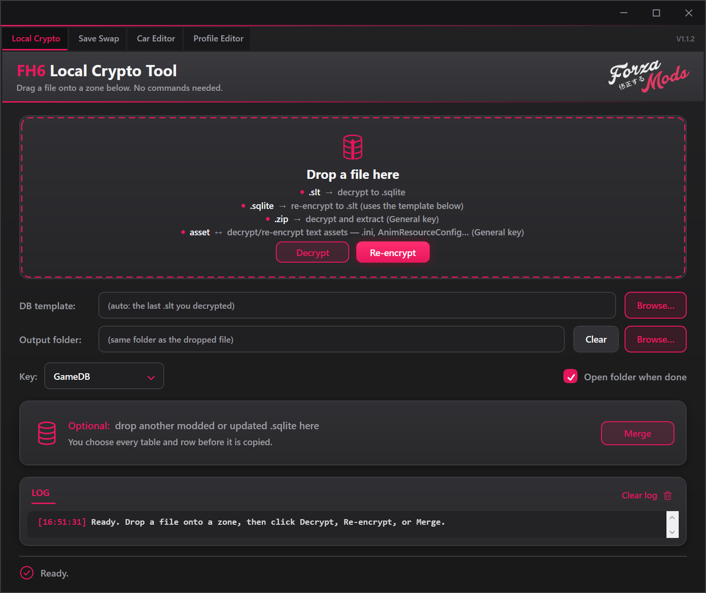

### The most important concept

The GameDB can be handled in two ways:

1. Direct workflow: load the encrypted `gamedbRC.slt` in Car Editor and export a new `.slt`.
2. SQLite workflow: decrypt to `.sqlite`, edit/export SQLite, then re-encrypt with the original SLT template.

Both workflows use a private temporary SQLite working copy internally. The loaded file is never edited directly.

### Required GameDB folder setup

FH6 includes an original GameDB under `media\stripped`. Do not decrypt, edit, rename, or replace that original. Copy it into `MediaPC\stripped` and perform all GameDB work on the copy in `MediaPC`.

```text
<FH6 install>\media\stripped\gamedbRC.slt    Original source — leave untouched
<FH6 install>\MediaPC\stripped\gamedbRC.slt Working copy — load this one in Car Editor
```

Before copying, back up any `gamedbRC.slt` that already exists in `MediaPC\stripped`. It is also wise to keep an additional backup outside the game directory.

The `MediaPC\stripped` working folder might eventually contain:

```text
gamedbRC.slt                       Working encrypted GameDB
gamedbRC_modified.slt              New file exported by Car Editor
gamedbRC.decrypted.sqlite          Optional decrypted database
gamedbRC_modified.sqlite           Optional SQLite export
```

Never modify or delete the original under `media\stripped`. Use the copied `MediaPC\stripped\gamedbRC.slt` as the template when rebuilding your edited database.

## Your first complete car edit

This walkthrough covers the full process from the original game file to a rebuilt file. For your first test, make only one small and easy-to-recognize change.

### Part 0: leave the car you plan to modify

Before closing the game to begin your edit:

1. Switch out of every car you intend to modify.
2. Make an unrelated, unmodified car your currently active car.
3. Wait for the game to save the car change.
4. Close the game normally.

Do not close the game while sitting in a car you are about to change in the database. When the modified database is installed, the game may try to load that saved garage instance immediately with upgrade references that no longer match.

### Part 1: copy the original GameDB

1. Close the game.
2. Open the game's installation folder.
3. Open `media\stripped` and find the original `gamedbRC.slt`.
4. Copy, rather than move, that file.
5. Open `MediaPC\stripped` and paste the copied `gamedbRC.slt` there.
6. If `MediaPC\stripped\gamedbRC.slt` already exists, back it up before replacing it.
7. From this point onward, use only the copy under `MediaPC\stripped`. Leave `media\stripped\gamedbRC.slt` untouched.

### Part 2: load the GameDB directly

1. Open Forza Mod Tool.
2. Select **Car Editor** and click **Load SLT / DB**.
3. Select the copied `MediaPC\stripped\gamedbRC.slt`, not the original under `media\stripped`.
4. Wait for the car list and database totals. The editor decrypts into a private working copy.

### Part 3: edit one car

1. Select the **Car Editor** tab.
2. Keep the copied `gamedbRC.slt` loaded from Part 2.
3. Confirm the full loaded path shown beneath the Car Editor title.
4. Wait for the car list and database totals to appear.
5. Use the search box to find a car you own and can easily test.
6. Click the car once to select it.
7. Make one small change. For example, enable **Available in Autoshow** or add one sensible fitment option.
8. If you changed Wheels & Fitment, Drivetrain, or Tires & Stance, review every checked option and click **APPLY changes to this car**. Autoshow, engine, motor, price, and handling actions do not need this Apply button.
9. Read the activity log and confirm that the operation completed.
10. Click **Export SLT**.
11. Save it with a new name such as `gamedbRC_modified.slt`.

The loaded SLT is not modified. The new SLT is built from the working copy, checked, and written separately.

### Part 4: optional SQLite workflow

If you prefer SQLite, use **Crypto → Decrypt** first, load the decrypted `.sqlite` in Car Editor, and click **Export DB**. Then use **Crypto → Re-encrypt** with the original SLT template. You can also export `.sqlite` from an SLT-loaded editor. If you export an `.slt` from a SQLite-loaded editor, the tool asks for the original encrypted SLT template.

### Part 5: test the rebuilt file

1. Make sure the game is closed.
2. Back up the current `MediaPC\stripped\gamedbRC.slt` somewhere safe.
3. Copy the newly exported `gamedbRC_modified.slt` into `MediaPC\stripped` (or the re-encrypted SLT if you used the optional SQLite workflow).
4. Rename the copied file to `gamedbRC.slt` so the game recognizes it.
5. Start the game. It should load with the unrelated, unmodified car you selected before closing it.
6. Do not select an old garage copy of the car you modified.
7. Buy a fresh copy of the modified car from the Autoshow and build it again from stock.
8. Test only the database change you made.
9. If the game hangs, crashes, or behaves incorrectly, close it and restore the original backup.

Do not install the modified file into `media\stripped`. All edits and replacements belong in `MediaPC\stripped`.

Once this basic workflow succeeds, repeat it with additional edits. Testing a few changes at a time makes it much easier to identify an incompatible value.

## Which buttons require Apply?

This distinction is important:

- Checkbox-based fitment, drivetrain, tire, and stance options require **APPLY changes to this car**.
- Engine, motor, Autoshow, FE-car, global-price, and enhanced-handling buttons change the temporary working database immediately.
- Both kinds of changes still require **Export SLT** or **Export DB** to create a new file.
- Direct SLT exports are ready to install after backup and testing; SQLite exports must be re-encrypted first.
- Garage field edits use **Apply car fields** (or **Apply checked fields** for a batch), then **Export edited save**. Add/Remove/Duplicate/Set as current car change only the garage working copy until export.
- DB Browser uses **Write changes** for a working-copy checkpoint, then **Export as** for the output file. Each tab has its own working copy.

If a change does not appear in game, check this chain:

```text
Choose option → Apply if required → Export SLT → Install the new SLT
```

## Output-name cheat sheet

| Operation | Example input | Example output |
|---|---|---|
| Edit GameDB directly | `gamedbRC.slt` | `gamedbRC_modified.slt` |
| Decrypt GameDB | `gamedbRC.slt` | `gamedbRC.decrypted.sqlite` |
| Re-encrypt GameDB | `gamedbRC_modified.sqlite` | `gamedbRC_modified.re-encrypted.slt` |
| Decrypt text asset | `PhysicsSettings.ini` | `PhysicsSettings.decrypted.ini` |
| Re-encrypt text asset | `PhysicsSettings.decrypted.ini` | `PhysicsSettings.modded.ini` |
| Decode skeleton | `skeleton.skeld` | `skeleton.decrypted.skeld.json` |
| Rebuild skeleton | `skeleton.decrypted.skeld.json` | `skeleton.modded.skeld` |
| Extract encrypted ZIP | `Example.zip` | `Example.extracted` folder |
| Merge database | base `.slt` or `.sqlite` | new `.slt` or `.sqlite` matching the base |
| Export car-related DB | modified `.slt` or `.sqlite` | selected car's merge-only `.sqlite` |
| Import car DB | receiving `.slt` or `.sqlite` + car donor | new `.carmerge.<car-id>.<timestamp>.slt` or `.sqlite` |
| Merge updated DB | clean update + old modded DB | new `.updatedmerge.<timestamp>.slt` or `.sqlite` |
| Build save swap | target `C_ProfileData` | `C_ProfileData.swapped` |
| Edit garage | `C_ProfileData` | `C_ProfileData.garage-edited` |
| Decrypt profile database | `C_ProfileData` | `C_ProfileData.sqlite` |
| Re-encrypt profile database | `C_ProfileData.sqlite` + original profile template | `C_ProfileData.re-encrypted` |

The tool does not overwrite the original input during these operations.

## Section 1: Crypto

Use the **Crypto** tab for encrypted GameDB files, supported text assets, ZIP extraction/rebuilding, FH6 `C_ProfileData`, and database merging. Manual GameDB decrypt/re-encrypt is optional when Car Editor loads an SLT directly.

For GameDB work, always use the copied file at `MediaPC\stripped\gamedbRC.slt`. Keep the original `media\stripped\gamedbRC.slt` untouched.

### Decrypt a GameDB

1. Open **Crypto**.
2. Optionally choose an **Output folder**. Otherwise, output is written beside the dropped file.
3. Drag `gamedbRC.slt` onto the large drop area.
4. Confirm that the staged-file message identifies it as an SLT ready to decrypt. The appropriate GameDB method is selected automatically.
5. Click **Decrypt**.
6. Wait for `Decrypted OK` and check the log for a valid SQLite header.
7. The output is named `gamedbRC.decrypted.sqlite`.

The original SLT is retained and remembered as the DB template for the current session.

### Re-encrypt a GameDB

1. Start with a decrypted or edited SQLite database.
2. If you decrypted its original SLT in the same session, the template is already selected.
3. Otherwise, click **Browse** beside **DB template** and select the original matching `gamedbRC.slt`.
4. Drag the edited `.sqlite` onto the main drop area.
5. Confirm that it is staged as SQLite ready to re-encrypt.
6. Click **Re-encrypt**.
7. The output is named `<database-name>.re-encrypted.slt`.
8. Preserve the original game file, then copy and rename the rebuilt file only when ready to test.

Always use the original SLT from the same game build as the SQLite database being rebuilt.

### Decrypt and re-encrypt FH6 C_ProfileData as SQLite

For normal garage changes, use [Garage Viewer](#garage-viewer--garage-editor-fh6); no separate decryption is needed. The SQLite route is for advanced database editing.

1. Close FH6, back up the **entire save folder**, and copy the original encrypted `C_ProfileData` into a separate working folder.
2. Drop that copy onto Crypto's main area and click **Decrypt**. The tool extracts its embedded database as `C_ProfileData.sqlite` and remembers the original as a separate **Profile template**.
3. Open the SQLite in **DB Browser** or another SQLite editor. Make your changes, then **Write changes → Export as SQLite** in DB Browser. Do not export this profile database as a GameDB SLT.
4. Drop the edited SQLite onto Crypto and click **Re-encrypt**. After restarting the tool, use **Profile template → Browse** to choose the matching original encrypted profile first.
5. Check the log and keep the new `.re-encrypted` output separate until installation. For an encrypted output, back up the live save and rename the installed copy to exactly `C_ProfileData`.

The other three save sections are preserved byte-for-byte from the selected template. Profile SQLite is detected by its save-specific schema even if renamed; committed WAL changes are included in the snapshot. Older full-payload `.decrypted` exports remain supported. Profile Editor and Garage Viewer still load complete profile files, not this standalone SQLite. This does not swap account identity or change Save Swap, and FM8 saves are not supported. Manual SQL save edits require careful backups and in-game testing.

### Decrypt an encrypted text asset

This workflow supports authenticated text containers such as `PhysicsSettings.ini`, XML, JSON, TXT, and extensionless configuration assets.

1. Drag the encrypted asset onto the main drop area.
2. The tool detects the container structure and selects the General method automatically.
3. Click **Decrypt**.
4. Confirm that the log reports plausible text output.
5. The output keeps the original extension and adds `.decrypted` before it. For example, `PhysicsSettings.ini` becomes `PhysicsSettings.decrypted.ini`.
6. Edit the decrypted copy with a text editor. Preserve its syntax, encoding, section names, and required delimiters.

### Re-encrypt an edited text asset

1. Keep the original encrypted asset available as the template.
2. Drag the edited decrypted text file onto the main drop area.
3. Click **Re-encrypt**.
4. If the original cannot be found automatically, select it when prompted.
5. The rebuilt output is written as `<asset-name>.modded<extension>`.
6. Check the log for a successful authenticated rebuild before testing it in game.

Do not use a different asset or a file from another game build as the template.

### Decode and rebuild a skeleton (`.skeld`)

SKELD files are **not encrypted**: they are binary BSI skeleton data. The Crypto tab uses its existing buttons to convert them to editable JSON and back; no key or external template is needed.

1. Drop `skeleton.skeld` onto the main area and click **Decrypt**. The tool writes `skeleton.decrypted.skeld.json` without changing the original.
2. In the JSON, edit an existing bone's hexadecimal `id`, `parent` index, `translation` (3 floats), `scale`, or `rotation` quaternion (4 floats). Keep `originalBase64` and `originalSha256` intact: they preserve unknown binary fields and padding.
3. Drop the edited JSON onto the main area and click **Re-encrypt**. The tool recognizes SKELD JSON even if an editor names it `skeleton.decrypted.skeld.modded.json`, then rebuilds and validates `skeleton.modded.skeld`. Do not use a generic `re-encrypted.json` asset container as a skeleton.

This conversion keeps the existing bone count and file layout. It does not add or remove bones or rebuild a car ZIP. New outputs receive a numbered name if one already exists; inputs are never overwritten. Test a modified skeleton on a backed-up car first.

### Extract an encrypted ZIP

1. Drag the `.zip` onto the main drop area.
2. Format/key detection is automatic; there is no manual Key dropdown.
3. Click **Decrypt**.
4. Extracted files are written into `<zip-name>.extracted`.
5. Review the log for the authenticated entry count and total extracted size.

Supported FH6 ZIP workspaces can also be rebuilt: edit the extracted files, drop the whole folder or round-trip manifest into Crypto, and click **Re-encrypt**. Keep the original template/metadata unchanged; old FH6 extraction-only folders must be extracted again. Do not add/remove entries. For Motorsport ZIPs and their LZX dependency, see [Section 7](#cameracar-zip-rebuilding-and-the-lzx-dll).

### Share or import a car DB

1. Finish editing the car and export your modified GameDB from Car Editor.
2. Drop that modified `.slt` or `.sqlite` into Crypto's large top area.
3. Click **Export Car Related DB**, select one car, and save the donor `.sqlite`.
4. Share that donor with your car mod. It contains the car's related stock and modified rows, including bodies, parts, fitment, upgrades, presets, and linked engine/motor/physics records. It is a merge donor, not a GameDB to install or re-encrypt directly.
5. To install it, put the receiving full GameDB in the top area and the exported car donor in the lower merge area.
6. Click **Import car DB**. Enable **Use donor values for conflicting rows of this car** if you want the donor to replace the receiving DB's matching rows, then confirm to write a new output.

The result follows the receiving DB's format: `.slt` in produces an encrypted `.slt`, and SQLite in produces SQLite. Shared engine or physics records can also affect other cars using them. The general **Merge** button remains available for manual table and row selection. See the [advanced merge reference](#merge-another-database) for details.

### Merge after a game update

1. Keep your old modded GameDB and obtain a clean GameDB for the newly installed game version.
2. Drop the **clean updated DB into the top area**.
3. Drop your **old modded DB into the lower merge area**.
4. Click **Merge updated DB**, review the source names and preview, and confirm.
5. Test the new output before using it as your active GameDB. Both original files remain available.

The app matches your old modded DB's `VersionInfo.database_version` to an embedded clean reference from that same game version. It compares the old clean reference with your modded DB, then applies only your additions, edited fields and deliberate deletions onto the new clean DB. Untouched official updates, new cars and the updated version stamp are retained. This action accepts SLT or SQLite in either area and produces the top file's format.

Older clean references are kept alongside newer references, not replaced. If no unique embedded reference matches, the app asks you to choose the **unmodified full GameDB from the same version as the old modded DB**. A version stamp identifies a build but does not prove a user-supplied reference is clean. Your edits win same-field conflicts; deliberate deletions of old keys win over official edits to those keys. Keyless tables use exact-content differences and duplicate counts, so independently changed official and modded variants can coexist. See the [advanced update-merge reference](#merge-an-updated-game-database-with-your-old-modded-database) and test before installing the output.

### Crypto controls

- **DB template** selects the original SLT used to frame a rebuilt GameDB.
- **Output folder** overrides saving beside the input.
- **Clear** returns output to the input file's folder.
- File staging automatically detects the supported format/key usage; no manual Key selector is needed.
- **Open folder when done** opens the completed output's location.
- **Clear log** clears only the on-screen activity history.

The activity log confirms each staged, decrypted, re-encrypted, or extracted file.

## Section 2: Car Editor

Car Editor accepts an encrypted `.slt` or decrypted `.sqlite`. It works on a temporary SQLite copy and exports a new file; the loaded input stays untouched. An SLT input defaults to SLT output, while a SQLite input defaults to SQLite output.

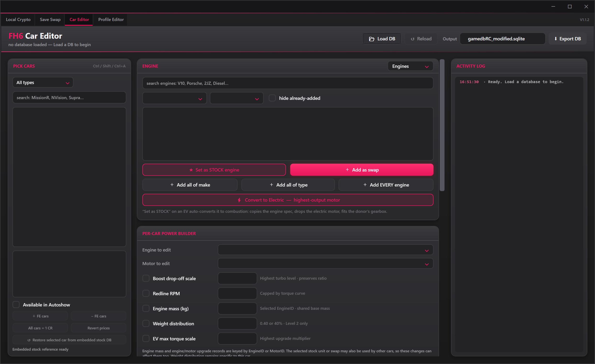

### Important: prepare and replace modified cars safely

Before closing the game to install a database edit, switch to a car you are not modifying and wait for the game to save. Never leave your character sitting in the car whose database records you are changing.

After installing the modified GameDB, treat existing garage copies of every modified car as incompatible. Buy a fresh copy from the Autoshow and rebuild it from stock before testing the changes. Older garage copies can retain references to the previous stock parts, installed upgrades, or upgrade-tree rows and may crash the game when selected or loaded.

This is especially important after:

- Applying enhanced handling or overwriting stock handling data.
- Replacing the stock engine, motor, drivetrain, transmission, suspension, or other stock configuration.
- Changing or rebuilding upgrade options that were already installed on the saved garage car.
- Removing, replacing, or repurposing database rows used by an existing build or tune.

If you modified several cars, remain in a completely unrelated car until fresh copies of the modified vehicles have been purchased and rebuilt.

### Load a database and choose a car

1. Open **Car Editor**.
2. Click **Load SLT / DB** and select the copied `gamedbRC.slt` or a decrypted SQLite database.
3. If using an SLT, the editor decrypts it into a private temporary SQLite file.
4. The editor creates a temporary working copy. The selected file is not edited directly.
5. Use the search field or type filter to find a vehicle.
6. Filters include ICE, EV, ICE-to-EV, EV-to-ICE, bodykit presets, and cars modified relative to the embedded stock database. BaseCost and Autoshow availability are intentionally excluded from the Modified cars filter.
7. Select a car and review its details.

Changes remain in the temporary working database until **Export SLT** or **Export DB** is used.

The editor carries compressed, versioned stock GameDB references inside the application. It selects the reference matching the loaded database's `VersionInfo.database_version` on every load. This enables **Modified cars only** and **Restore selected car from embedded stock DB** without comparing against the wrong game build. Comparison and restoration are disabled for unknown or ambiguous versions; restoration is also disabled in batch mode and for cars absent from the matched reference.

Version 1.2.6 includes the new **682-model FH6 reference** and retains the older **671-model reference**. Garage Viewer defaults to the new catalog; Car Editor and updated-DB merging select a reference by the database's build stamp, not by the app version or numerical stamp order.

The selected-car summary shows its powertrain, available engine options, fitment basics, Autoshow state, and stock-restore control:

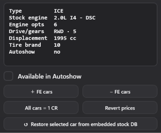

The type filter can narrow the list to bodykit presets or specific powertrain types.

### Autoshow and global prices

- **Available in Autoshow** changes availability for the selected car.
- **+ FE cars** makes every Forza Edition car available in the Autoshow.
- **- FE cars** hides every Forza Edition car, including those available in the loaded database.
- **All cars = 1 CR** sets every car's BaseCost to 1 in the working database.
- **Revert prices** restores prices captured when the current database was loaded.

These controls update the working copy immediately, but the database must still be exported.

### Engine and motor editing

1. Select a car.
2. Choose **Engines** or **Motors**.
3. Search or filter the list and select an item.
4. Choose an action:
   - **Set as STOCK engine** replaces the stock engine. On an EV, it converts the car to combustion and fits a donor drivetrain when available.
   - **Add as swap** adds the engine as a selectable upgrade.
   - **Add all of type** adds every engine matching the selected layout, such as I4, I6, V6, or V8.
   - **Add EVERY engine** adds the full engine list after confirmation.
   - **Set as STOCK motor** converts the car to an EV with the selected motor.
   - **Add as motor option** adds the selected motor as an option.
   - **Add EVERY motor as a swap option** adds all motors.
   - **Convert to Electric — highest-output motor** performs an automatic conversion using the highest-output motor in the loaded database.

Engine and motor actions apply immediately to the working copy. Watch the activity log for skipped or existing entries.

Drag the grip immediately below the engine/motor list to make it taller or shorter. The dividers between the car picker, options, and activity log resize their widths. Layout changes last for the current session and do not change database contents.

ICE and EV configurations are mutually exclusive. Converting to electric removes the car's combustion-engine rows, while setting a combustion engine as stock removes its motor rows and copies an appropriate donor engine/drivetrain specification.

### Per-car power builder

The power builder can target the selected car's stock unit or one of its added swaps:

- **Boost drop-off scale** changes only the highest turbo-upgrade row for the selected EngineID and preserves the original relationship between `TorqueDropOffScale0` and `TorqueDropOffScale1`.
- **Redline RPM** edits camshaft upgrades and is capped by each row's torque-curve maximum RPM.
- **Engine mass (kg)** edits the selected stock engine or swap's shared `Data_Engine.[EngineMass-kg]` value. It is intentionally unavailable in batch mode.
- **Weight distribution** edits only the Level 2 body-weight upgrade for the selected car.
- **EV max torque scale** adjusts the highest motor-parts multiplier instead of applying a hidden conversion multiplier.

Engine mass and engine/motor upgrade tables are keyed by EngineID or MotorID. If another car uses the same unit, shared changes can affect that car too. The editor shows this warning beside the controls.

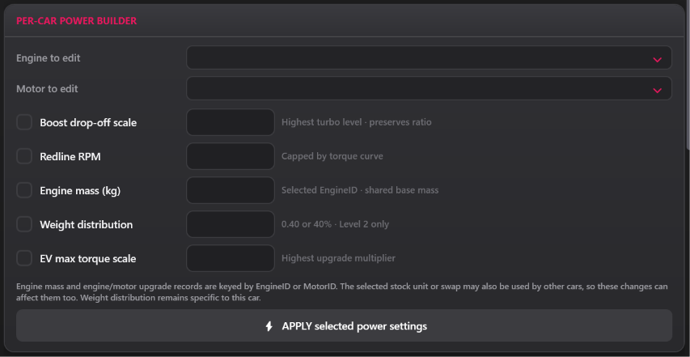

### Wheels and fitment

1. Select **Stock body** or a numbered **Widebody** tab.
2. Only the active body tab receives tire-width, tire-profile, and track-offset edits.
3. To edit stock and widebody fitment, configure and apply one tab, then switch tabs and repeat.
4. Check only the sections the next Apply operation should write.
5. Leave a box blank to skip it. Use **+** to add more absolute-value boxes, or use the repeatable step buttons to queue relative upgrades.

Numeric boxes accept either `0.05` or `0,05` regardless of the PC's region. Prefilled values display using the PC's regional decimal separator, and the compact step buttons queue the same numeric values without extra boxes. Invalid nonblank fitment values stop Apply before any rows are changed.

The **+** beside the body tabs can add a widebody kit only to a car that has no factory widebody kit. A new kit copies the required body data and stock/default part rows; it does not automatically create six extra bumpers, hoods, skirts, or wings. Cars with existing factory kits remain restricted because our tests found that adding another kit to them could crash the game. Keep an untouched database backup and test each added kit in-game before distributing it.

The five **+ Add one** rows below the body tabs add one front bumper, rear bumper, side skirt, hood, or rear-wing option with a left-click. Right-click the same button to remove the last added non-stock option in the selected body's ID block. Stock-reference parts and parts used by an upgrade preset cannot be removed this way. The first four categories belong to the selected body. Rear wings are stored per car by the game, so a new wing is visible across that car's bodies even though its ID is allocated from the selected body's range. These database options are placeholders for modders to link to matching visual parts in their car files.


Select an added Widebody tab and click **−** to remove that kit and its body-specific database rows after confirmation. Stock and factory bodykits are protected. The loaded database is unchanged until you export the editor's working copy.

Each widebody tab shows its **upgrade PartId** (`List_UpgradeCarBody.Id`). The line below the tabs also shows its separate `CarBodyID`, car `Ordinal`, and level, so visual modders can coordinate existing database IDs with their car files.

The prefilled **Wheelbase (m)** and **Bottom-center wheelbase Z** boxes edit the active body's `Data_CarBody` values when you click **Apply changes to this car**. `ModelWheelbase` is displayed separately and is not changed by these boxes. Back up the database and test geometry edits in game.

If a car has more than one widebody upgrade, each widebody receives its own numbered tab. Treat every body tab separately and click Apply while the body you intend to edit is active. Rim sizes are the exception because the rim-size list is shared by the whole car.

Available fields:

- **Rim sizes:** Shared front and rear wheel diameters in inches. These are car-level, not separate per body tab.
- **Tire widths:** Absolute front and rear tread widths in millimetres.
- **Tire profile:** Front and rear aspect-ratio offsets. Negative values create a lower profile.
- **Track width / offset:** Front and rear spacer offsets. Start small, such as `0.03`, `0.05`, or `0.08`.

Single-car mode keeps the prefilled absolute boxes and also provides the same repeatable controls as batch mode: rims `−1`/`+1` inch, widths `−10`/`+10` mm, profiles `−2`/`+2`, and track `+0.02 m`. Each click queues another upgrade beyond the current smallest or largest choice; right-click removes the last queued level. Tire-width, profile, and track steps apply only to the active **Stock body** or **Widebody** tab. Relative steps are append-only, preserve existing choices, and skip duplicates.

**Reset fitment to stock (selected body)** removes non-stock tire-width, tire-profile, and track-offset options from the active body. It does not reset the shared rim-size list.

#### Multi-car batch fitment

Ctrl-click or Shift-click cars in the list to enter batch mode. Batch fitment preserves every stock and existing upgrade row and adds only genuinely new values.

- Rim buttons add `−1` inch below the smallest or `+1` inch above the largest existing choice per click.
- Front and rear tire-width buttons add `−10` mm below the narrowest or `+10` mm above the widest existing choice per click.
- Tire-profile buttons add `−2` points below the lowest or `+2` points above the highest existing offset per click.
- Track-width buttons add `+0.02 m` per click beyond each axle's widest existing option; no smaller-track preset is provided.
- Each button may be clicked repeatedly. Its count shows the number of queued levels, and right-click removes the most recently queued level.
- Queued values are stored from lowest to highest, including their database row ordering. Track choices advance in exact `0.02 m` steps from one fixed starting point.
- Existing matching values are skipped, and pressing Apply again does not create duplicate upgrade rows. Stock values remain available in game and are not duplicated as upgrade rows, so the editor can show one intentional gap at the stock value.

Batch mode also supports suspension, drivetrain, tires, engine operations, power-builder settings, Autoshow availability, and price actions where shown. Single-car mode remains prefilled for direct absolute editing while also offering the repeatable relative step buttons.

Large batch Apply jobs group their SQLite writes into one transaction and show car-by-car progress. The editor controls are temporarily disabled so the selected settings stay fixed, but the window can repaint between cars. If Apply encounters an unexpected error, the grouped writes are rolled back. This is a CPU/SQLite optimization; no GPU is required.

### Drivetrain options

- **Add RWD conversion option** adds a selectable rear-wheel-drive conversion.
- **Add FWD conversion option** adds an experimental front-wheel-drive conversion using a valid drivetrain in the loaded database.
- **Manual transmission (EVs → geared)** gives an electric car a six-speed gearbox and transmission upgrade tree while keeping it electric.

Check the desired items, then click **APPLY changes to this car**.

### Tires and stance

- **Whitewalls + vintage set** changes the tire brand and replaces the car's tire list with the curated vintage set.
- **Forza Edition tire set** adds FE tire models and compounds without removing current ordinary tires.
- If both tire options are checked, the vintage set is created first and FE choices are added afterward.
- **Remove suspension limit — drift suspension** creates a Drift suspension when missing and lowers its ride-height/compression limits.
- **Remove suspension limit — race suspension** is a separate, opt-in option using the same lower-limit settings for Race suspension. It creates the upgrade when needed and leaves existing Race steering angles unchanged; there is no Race steering-angle field.
- **Steering angle** sets the Drift suspension steering angle; `50.0` is supplied as the starting value.
- **Lift kit — rally suspension (+20 in)** creates a Rally suspension when missing and extends maximum ride height exactly `20 in` (`0.508 m`) above stock maximum.

Select the desired options and click **APPLY changes to this car**.

Before pressing Apply, review every checkbox in this section. A checked suspension or tire option is included even if you were mainly editing a different section.

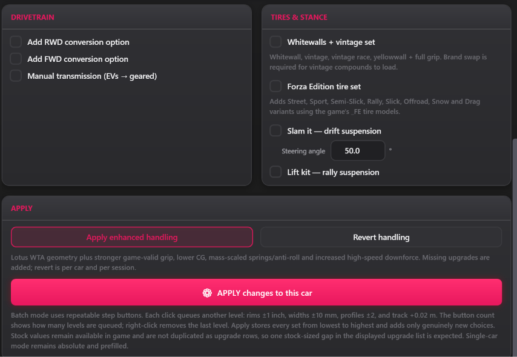

### Enhanced handling

1. Select a car.
2. Click **Apply enhanced handling**.
3. The editor applies the handling package and creates required suspension, anti-roll, tire, chassis, and weight upgrades when missing.
4. Test extreme handling edits carefully. Large changes can produce unrealistic behavior or instability.
5. To undo it during the same editing session, select the car and click **Revert handling**.

Handling reversion is stored per car for the current session. Reloading the original database clears the session snapshots.

### Apply, reload, and export

- **APPLY changes to this car** writes checked fitment, drivetrain, tire, and stance sections to the working copy.
- Engine, motor, Autoshow, FE-car, price, and enhanced-handling buttons act immediately on the working copy.
- Pending fitment inputs and repeatable step-button clicks remain in place when you apply engine or power changes; applying fitment does not clear pending power-builder inputs. You can prepare both sections before pressing their separate Apply buttons.
- **Reload** discards current working changes and reloads the original selected database.
- **Export SLT / Export DB** writes a new encrypted `.slt` or decrypted `.sqlite`. The default matches the loaded format; a SQLite-to-SLT export asks for the original encrypted template.

Recommended finish:

1. Review the activity log for warnings or skipped operations.
2. Click **Export SLT** when an SLT is loaded, or **Export DB** for SQLite.
3. If you exported SQLite, return to Crypto and re-encrypt it with the matching original SLT template.
4. Back up the game's current SLT before installing and testing the new one.

## Section 3: Animation Swap

Animation Swap is the integrated, re-themed v2.2 animation tool. It accepts a complete car ZIP or a raw `carclips_<ID>.clipd`, keeps the source file untouched, and saves a new structurally verified result.


### Swap door animations

1. Open **Animation Swap**.
2. Drag in a clean complete car ZIP or raw `carclips_<ID>.clipd`, or click **Browse**.
3. Select **Front doors** or **Rear doors**.
4. Choose a donor car from the built-in animation library.
5. Click **Apply donor → selected animation**.
6. Front and rear doors may use different donor cars. If a donor has no rear-door data, the tool can use its matching front-door motion as a fallback.
7. Click **Save As** and test the new file in game.

The tool warns when a known car's starting animation data differs from its stock baseline. Start from a clean game file whenever possible.

### Other animation channels

Expand **Other channels (experimental)** to inspect supported hood, trunk, wing, and other non-door channels. Direction has not been verified for every car/channel combination, so test these changes carefully.

Expand **Manage CLIPD channels** to see every animation in the loaded car. Select channels under **This car** and click **Remove selected**, or load a donor CLIPD/car ZIP, select its channels, and click **Add selected**. Imports preserve the donor channel IDs and skip IDs already present; they do not overwrite an existing animation. Nothing is written until **Save As**. The tool checks the rebuilt channel count and preserves every unaffected animation record. New part animations may also require matching skeleton bones and Mojo events to play in game.

Select one channel under **This car** and click **Adjust start/end...** to edit its animation endpoints. Choose the animated track; the boxes show that track's current start and end positions (metres) and rotations (degrees) from the loaded CLIPD. Edit the values you want to change and leave the others untouched. The tool blends the changes through the frames and rebuilds that channel. Save As creates a separate patched file; keep your original and test the result in game. Other channels remain byte-for-byte unchanged, though lossy recompression can slightly change intermediate frames within the edited channel.


CLIPD stores compressed Mojo/ACL animation records, not embedded GR2 files. Blender/GR2 export and import are not available yet. The endpoint editor uses bundled ACL tools; their license notices are included alongside the app.

### Database stance compatibility

**Fix DB ride height / spacers** removes authored suspension animation channels that can override ride-height and track-width changes made in the GameDB. This is intended for cars whose animation data prevents database stance edits from rendering correctly.

### Animation output safety

- Complete ZIP input produces a complete patched ZIP with the original archive layout retained.
- Raw CLIPD input produces a new CLIPD file.
- **Reset** reloads the original source and discards unsaved animation changes.
- Before writing, the tool rebuilds and reparses the CLIPD, validates its size trailer, checks its node-stream boundary, and blocks structurally unsafe output.

## Section 4: Save Swap

Use Save Swap when you want to put the progress from one FH6 save into another account's save container. The save containing the progress is the **donor**. The save belonging to the account that will use that progress is the **target**.

The tool writes a new verified file beside your copied target. It does not overwrite either input file.

> **Testing notice:** Save Swap has passed automated cryptographic/round-trip verification and has now been successfully confirmed in game by a user. Account, cloud-sync, and game-build differences still make untouched backups essential.

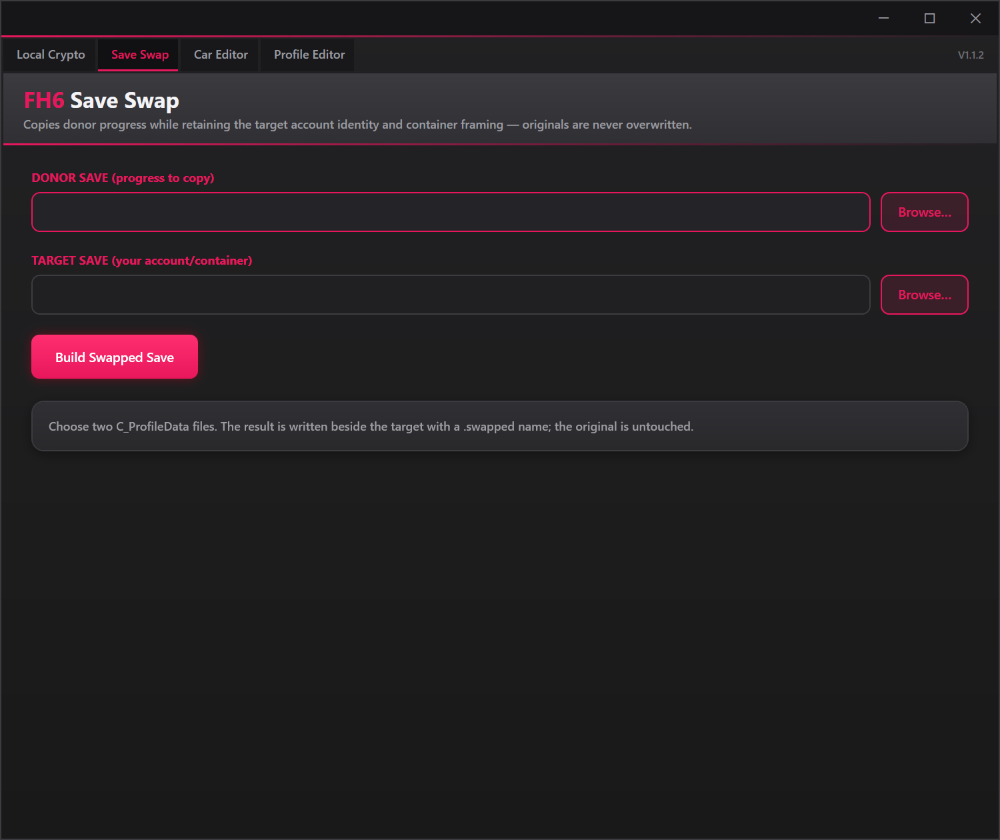

### Find your C_ProfileData

On the current Xbox Gaming Services save layout, the active profile is normally located at:

```text
C:\XboxGames\GameSave\pgs\u_<your decimal XUID>_<suffix>\current\ContainersRoot\User_<hex account ID>\C_ProfileData
```

If Windows stores Xbox game saves on another drive, begin with that drive's `XboxGames\GameSave\pgs` folder instead.

To find it:

1. Close FH6 completely.
2. Open `C:\XboxGames\GameSave\pgs` in File Explorer.
3. Open the folder beginning with `u_`.
4. Open `current`, then `ContainersRoot`.
5. Open the folder beginning with `User_` that does not end in `_Backup`.
6. Find the file named exactly `C_ProfileData`.

You may also see `C_ProfileData_SCopy` or `C_ProfileBackup`. For the target input, use the active file named `C_ProfileData`.

Do not select the live PGS file directly in Save Swap. First copy it into a separate working folder and keep another untouched backup. This keeps the generated `.swapped` file outside the live save directory.

### Before swapping a save

1. Close the game completely.
2. Copy the active target `C_ProfileData` out of the PGS directory and into a separate working folder.
3. Keep another untouched target backup in a different folder.
4. Put the donor in its own clearly named folder so you cannot reverse donor and target.
5. Use two different encrypted `C_ProfileData` files. The same file cannot be both donor and target.
6. Be prepared for cloud synchronization. A cloud copy may replace a local file when the game starts.

### Build the swapped save

1. Open the **Save Swap** tab.
2. Under **DONOR SAVE (progress to copy)**, click **Browse**.
3. Select the encrypted `C_ProfileData` containing the progress you want.
4. Under **TARGET SAVE (your account/container)**, click **Browse**.
5. Select the copied encrypted `C_ProfileData` belonging to the receiving account.
6. Double-check the two paths. Reversing them produces the opposite swap.
7. Click **Build Swapped Save**.
8. Wait for the tool to finish and verify the rebuilt result.
9. Read the result path displayed in the status box.

### Understand the output

The first result is written beside the copied target as:

```text
C_ProfileData.swapped
```

If that filename already exists, the tool keeps it and creates a timestamped result such as:

```text
C_ProfileData.swapped.20260910-153000
```

The selected donor and target files remain unchanged.

### Install and test the swapped save

1. Do not delete the original target.
2. Move the live target `C_ProfileData` into a safe backup location.
3. Copy the newly generated swapped file into the target save location.
4. Rename the copied result to exactly `C_ProfileData`.
5. Start the game and carefully check which local or cloud save it is about to use.
6. Confirm that the expected progress loads before continuing to play.
7. If the game rejects the file, loads unexpected data, or cloud sync chooses the wrong version, close the game and restore the untouched target backup.

## Section 5: Profile Editor

Profile Editor opens an encrypted `C_ProfileData`, validates and decrypts it locally, and presents both everyday controls and advanced data views. Export creates a new encrypted result; the loaded input remains unchanged.

### Overview

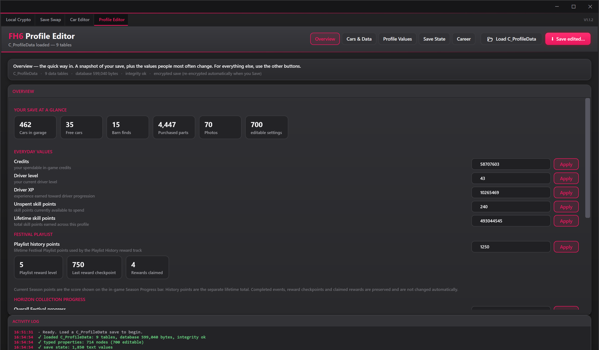

The Overview is designed for everyday players and labels values in plain language when the save exposes a recognized, safely editable layout. Depending on the save, it can include:

- Credits, driver level, and driver XP.
- Unspent and lifetime skill points.
- Current Season Progress points and separate Playlist History points.
- Playlist reward level, last checkpoint, and claimed-reward count.
- Horizon Collection and world-progress summaries.
- Character items owned, barn-find totals, car-experience unlocks, and festival-site status.

Current Season points use a guarded serializer-layout signature discovered through controlled before/after save comparisons. If a save layout is not recognized, the editor refuses to guess and leaves the value untouched. Editing points does not automatically complete challenges, claim rewards, or rewrite event history.

Everyday progression values use plain-language labels and individual Apply buttons:

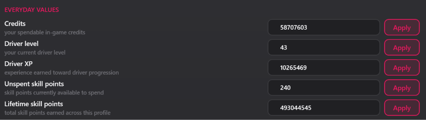

Festival Playlist controls keep Current Season points separate from lifetime Playlist History progress:

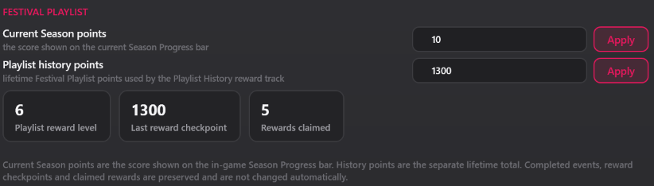

Recognized Horizon Collection categories are shown as separate progress values:

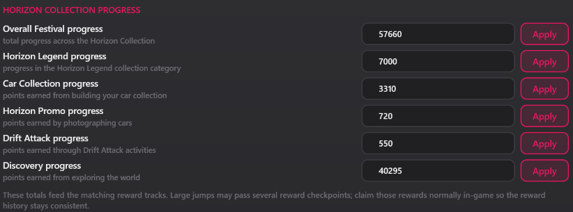

### Advanced views

Advanced users retain direct access to the underlying profile structures:

- **Cars & Data** browses and edits supported embedded SQLite tables.
- **Profile Values** exposes the searchable property tree with friendly paths.
- **Save State** and **Career** expose parsed records and their advanced XML representation.
- XML editors include syntax highlighting while preserving the original advanced editing workflow.

Advanced edits can make a profile invalid even when the encrypted container rebuilds successfully. Change one area at a time and keep an untouched save backup outside the live save directory.

### Export a profile edit

1. Close the game and copy the active `C_ProfileData` into a separate working folder.
2. Load the copied file in Profile Editor.
3. Make and review the desired edits.
4. Export to a new encrypted file and read the verification result.
5. Keep the original backup, then install and rename the exported copy only when ready to test.

## Garage Viewer / Garage Editor (FH6)

The **Garage Viewer** tab is the garage editor. It works directly with a complete FH6 `C_ProfileData`, using a private working copy; your loaded save is not edited in place. Garage Add/Remove, setting the current car, and Original Owner/history-field edits have been confirmed working. Save editing still requires an untouched full backup: that testing is not a guarantee for every save, game build, or manual SQL edit.

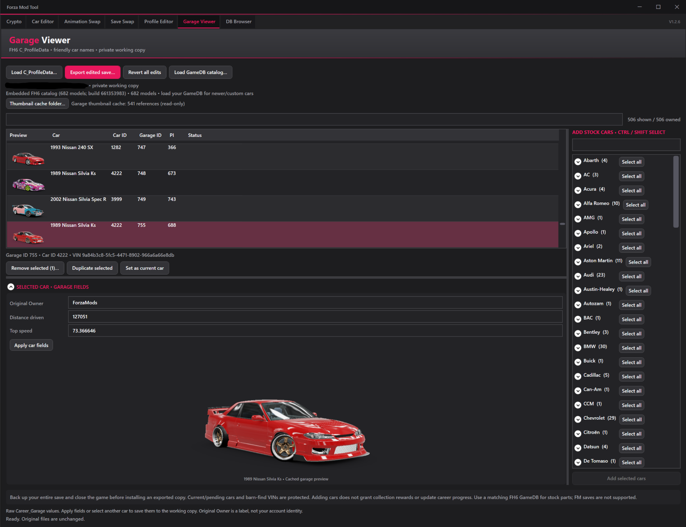

### Load and browse your garage

1. Close FH6, back up the **entire save folder**, and copy `C_ProfileData` into a separate working folder. See [where to find it](#find-your-c_profiledata).
2. Open **Garage Viewer → Load C_ProfileData…** and choose the copy. Encrypted and supported decrypted full profiles are accepted; standalone `C_ProfileData.sqlite` belongs in DB Browser, not this tab.
3. Expand a manufacturer to browse your owned cars. Search by friendly name, manufacturer, year, car ID, or garage instance ID. Cars use the same name formatter as Car Editor.
4. The stock catalog contains **682 models** by default. Use **Load GameDB catalog…** with your matching full FH6 `.slt` or `.sqlite` for newer/custom models or modified stock-part IDs. A single-car exported donor is not a full catalog; FM8 catalogs/saves are not supported.

Drag the horizontal divider above the selected-car fields to resize the owned list, or the vertical divider beside the stock catalog to resize its width. Collapse the fields for more list space. The slim dark/pink scrollbars match the other tabs.

### Add, duplicate, remove, or change the current car

- **Add selected cars:** select models in the right-hand stock catalog, then click the button to add one stock instance per selected model. Ctrl/Shift selects multiple models; a manufacturer's **Select all** selects its catalog group. A failed batch is rolled back together.
- **Duplicate selected:** select one owned instance to copy its configuration and purchased parts with a new garage ID and VIN. Shared tune/livery files are not copied or deleted.
- **Remove selected…:** select owned instances with Ctrl/Shift and confirm removal. A manufacturer's **Select removable** skips protected or unknown models. Removal deletes those garage rows and their linked purchased parts, not unrelated progression or shared designs.
- **Set as current car:** select one instance to change the saved current-car reference. This is not a change to the row's general Flags field. Current/pending cars, barn-find VIN references, and catalog removal locks are protected; choose another healthy current car before removing the current instance.
- **Revert all edits:** restore the snapshot taken when the profile was loaded, including the original current-car selection.

Unknown garage-linked schemas disable editing rather than guessing. Adding cars does **not** grant collection rewards, achievements, or career progress.

### Original Owner, Distance Driven, and Top Speed

Select an owned car to edit its **Original Owner**, **Distance driven**, and **Top speed**, then click **Apply car fields**. These are the `Career_Garage` values also shown by the advanced Profile Editor:

- Original Owner changes the car's text label, **not** the account identity/XUID.
- Distance Driven is a non-negative whole number, up to `2147483647`.
- Top Speed is a finite non-negative decimal; either `.` or `,` is accepted regardless of PC region.
- Both numeric fields use **raw database units**; the tool does not guess a kilometres/miles or speed conversion.

For batch editing, Ctrl/Shift-select owned cars and check **only the fields to replace on every selected car**. Typing checks that field automatically; uncheck it to keep each car's existing value. Mixed values show **Mixed — unchanged**. Click **Apply checked fields**; an invalid value or failed write cancels the whole batch. Checking an empty Original Owner clears the label; empty numeric values are invalid.

Selecting another car or exporting also validates pending field drafts. Invalid input is retained and blocks the action. Applying changes still does not create a save file—use **Export edited save…** afterward.

### Actual garage thumbnails and larger previews

Previews are matched to each saved car instance's thumbnail reference, so they can show cached paint, designs, and modifications rather than generic stock images. Selecting one car shows a larger preview below the fields, growing with the panel/window. Multi-selection clears that single-car preview. Small and large images preserve the original WebP transparency.

The default cache is `%LOCALAPPDATA%\ForzaHorizon6\LocalStorage_Cache\CacheThumbnails`. **Thumbnail cache folder…** selects another location. The cache is read-only; images are not bundled or inserted into exports. Missing/stale images show a placeholder, and newly added cars may need the game to generate a thumbnail. Windows WebP decoding support is needed for previews only; garage editing works without them.

### Export, install, and test

1. Review your selections and apply any field drafts.
2. Click **Export edited save…** and save to a new filename such as `C_ProfileData.garage-edited`. Export keeps the loaded profile's encrypted/decrypted format; it refuses to overwrite an existing file.
3. For an **encrypted** export, keep FH6 closed, back up the live save, and install a copy named exactly `C_ProfileData`. A decrypted full-profile export must be re-encrypted in Crypto with its original profile template before installation.
4. Check local/cloud synchronization carefully and verify the garage in game. Restore the untouched full backup if the result is not accepted.

Export verifies the rebuilt payload and preservation of non-garage/account sections, except for an explicitly requested current-car reference change. These checks do not establish compatibility for every possible save edit.

### Recovering a save after SQL Live Editor or GameDB edits

If a save stops loading or crashes because a car references incompatible edited parts, Garage Viewer can help remove that car and its purchased parts. Work on a **copy**, set a healthy car as current if needed, remove the affected car, and export a new encrypted save. Back up the entire save before installing and testing the recovered copy. Keep a compatible GameDB installed too; deleting a garage car does not repair broken GameDB rows.

This is a recovery route for **bad garage-car references**, not a guaranteed repair for every corrupt save. It cannot reconstruct missing data or fix unreadable encrypted containers, damaged SQLite, unsupported save layouts, unrelated progression corruption, or protected references it cannot safely remove. If the file will not load in the tool, restore a known-good full backup.

## Section 6: DB Browser

This is a native WPF database workspace inspired by DB Browser for SQLite 3.13.1, using the tool's dark/pink theme. It is an independent implementation, not an embedded copy of the Qt application.

### Main workflow

- Open an FH6 SLT or SQLite database, or start a new empty database. Every session uses an independent private working copy. New Motorsport additions elsewhere in the tool are not changed; unsupported Motorsport SLTs retain the existing bridge restriction.
- Database Structure lists tables, views, indexes and triggers, their columns and creation SQL. Create tables/indexes through dialogs; modify table names/columns or edit view/index/trigger definitions through SQL. Delete objects with confirmation.
- Browse Data has a table selector, sortable headers, per-column filters, global text search and page navigation. Column filters accept literal text, `=exact`, numerical `>`, `<`, `>=`, `<=`, and `NULL` / `NOT NULL`.
- Edit cells directly in the grid with a double-click, F2 or typing. Enter, Tab or clicking away saves the value to the private working copy; Esc cancels the current edit. Existing storage types are preserved; a NULL cell uses the declared column type when filled. Numeric edits accept dot or comma. Invalid values/constraint failures keep the editor open and leave database values intact. Refresh reapplies filters/sorting after edits.
- The right-hand editor remains available for long text, explicit type changes, NULL, and hexadecimal BLOB values. Use Apply cell for changes made in that panel only. New records use defaults for omitted fields. Views/generated columns and tables without a safe row identity are read-only in the grid.
- Execute SQL supports queries, modification scripts, selected-text execution, F5, Ctrl+Enter, opening/saving SQL files, and an SQL log. SQL numeric literals use dots. Commands are atomic and failed/cancelled scripts roll back together. Results display up to 1,000 rows; SQL execution has a 15-second limit.
- Export CSV writes **all records** of the selected table, not only the filtered page; generated columns are omitted. Text is quoted, SQL NULL is an unquoted empty field, and blobs are hex. Import CSV appends records to an existing table with matching headers; constraints or invalid input roll back the whole import. Imports accept comma-delimited RFC-style quoted fields and are limited to 64 MB / 100,000 records. CSV is not a full-fidelity backup of arbitrary SQLite storage classes; use SQLite or SQL dumps for that.
- Import/export SQL dumps covers schema and records, including indexes, triggers and AUTOINCREMENT counters. Common external transaction wrappers are removed because the runner supplies its own atomic operation. Imports are limited to 64 MB and the SQL execution limit. Virtual-table dumps are not supported.
- Edit Pragmas shows database properties. Only user_version and application_id are editable; storage and safety settings remain read-only.
- Write changes creates a new undo checkpoint in the working copy, not the input. Revert changes restores the previous checkpoint. Export as creates a new validated SQLite or SLT file; SQLite-to-SLT export requires an original encrypted template. Existing files are never overwritten.

### Safeguards and differences

Foreign-key enforcement remains off for the GameDB modding workflow; row deletion does not automatically delete related records. Use `PRAGMA foreign_key_check;` for diagnostics. The SQL authorizer blocks ATTACH/DETACH, extension/file access, explicit transaction commands, temporary/virtual-table creation, and unsafe PRAGMAs. SQLite integrity is checked during export, but in-game compatibility still requires testing.

This implements the main local editing/import/export workflow, not every feature of the upstream application: SQLCipher encryption, remote databases, plotting, syntax highlighting/autocompletion and multiple SQL-editor tabs are not included.

Changes in this tab are not shared automatically with Car Editor or Crypto. Export the edited database and reload that output in another tab when needed.

## Section 7: Forza Motorsport (FM8)

Motorsport support uses the existing **Crypto**, **Car Editor**, and **DB Browser** tabs. The FH6 GameDB folder, direct-SLT, merge, and profile instructions above are not Motorsport installation instructions.

**For supported FM files, modifying works basically the same as FH6: decrypt/extract, edit, then export/re-encrypt/rebuild. The main installation difference is that FM has no override folder.** Close the game, back up the original, and put the finished modified file at its original location under `Forza Motorsport\Content\media\`, replacing the original with the same filename. Keep the original subfolder structure—do not put every file directly in the `media` root.

For example, a rebuilt camera ZIP replaces the original `Content\media\base\camera.zip`; a modified car ZIP replaces its original car ZIP at that car's existing path. Rename the original to `.bak` or keep a separate untouched backup before replacing it, and never overwrite an existing backup. Install only the finished encrypted database/asset or rebuilt ZIP, not the temporary decrypted/editing files. The GameDB-specific steps below show the same backup-and-replace process.

### Supported workflows

- **GameDB:** authenticated decrypt/re-encrypt for the supported Motorsport TransformIT format.
- **General text assets:** decrypt/edit/re-encrypt supported files such as `GameTunableSettings.ini`, `physicssettings.ini`, and `ClientFeatureFlagConfiguration.json`.
- **CMS:** decrypt/re-encrypt supported entries and the separately authenticated cache manifest; inspect/extract CMS archives, including extensionless cached ZIPs. This does not automatically install or update a CMS cache.
- **Car Editor:** edit decrypted Motorsport SQLite using shared-schema options, including engines, power, suspension, rims/tire widths, and BaseCost. Missing FH6-only options are disabled.
- **Track offsets:** separate native per-car controls with input validation and reset to loaded values. Their in-game effect still needs testing.
- **ZIPs:** extract/rebuild supported camera/car LZX ZIPs, or extract large/deduplicated track ZIPs without rebuilding them.

### GameDB editing
Drop supported gamedb.slt into Crypto, Decrypt, edit the resulting FM SQLite in Car Editor or DB Browser, export SQLite, then Re-encrypt in Crypto with the original FM SLT template. The direct SLT Car Editor/DB Browser/merge path remains FH6-specific. FM shared-schema edits are enabled; missing FH6-only options are disabled. Save/profile workflows are FH6-specific.

### Install a modified Motorsport GameDB

Motorsport has **no override folder** for this workflow.

1. Close the game and open `Forza Motorsport\Content\media\base\db\`.
2. Rename the original `gamedb.slt` to `gamedb.slt.bak`. If a backup already exists, preserve it and back up the current file under another name; never overwrite the backup.
3. Copy the new **re-encrypted** modified file into this same folder and name it exactly `gamedb.slt`. Do not install a decrypted SQLite file.
4. Keep the original backup untouched so it can be restored. A separate backup outside the game folder is recommended.

### Camera/car ZIP rebuilding and the LZX DLL

FM method-21 LZX operations require a legally obtained **x64 `xcompress64.dll`** beside `FH6ModStudio.exe`. The DLL is not currently included. See [download/setup instructions](NATIVE_RUNTIME.md); other functions do not require it.

1. Drop a supported Motorsport camera/car ZIP onto **Crypto** and click **Decrypt**.
2. Edit files in the new extracted folder, keeping `forza-zip-roundtrip.json` and `.__original.zip` unchanged.
3. Drop the **whole extracted folder** (or its manifest) back into Crypto and click **Re-encrypt**.
4. Review the verified new `.modded.zip`; the original remains untouched. Do not add/remove entries.

Modified Motorsport camera/car ZIPs have been confirmed working in game.

### Track ZIP extraction

Track ZIPs use **extract-only** mode. The tool automatically looks for the matching `pcfamily\Dedupe.zip` (or a copy beside the input), resolves shared references, and checks decoded sizes/CRCs. Keep the matching shared archive available.

The output contains `forza-extract-only.json`, not a round-trip ZIP template. Track outputs and CMS archive extractions cannot be rebuilt through the camera/car ZIP workflow.

### Pricing limitations

CMS showroom-price edits change the purchase preview, but attempting to buy returns a server error. BaseCost edits did not change tested shop prices. This is not a working discounted-purchase mod or an automatic CMS installer. Boost edits and added rims displaying 0 CP have been confirmed in game.

Back up originals and test modified outputs in game. Successful cryptographic or SQLite validation does not guarantee the game accepts an edit.

## Temporary workspace

Tool-owned database, profile, garage, merge, stock-reference, and animation work prefers `A:\Forza Mod Tool Temp\Work` when A: exists. If that workspace cannot be used, the operation reports an error instead of silently filling C:. On PCs without A:, the normal per-user temporary location remains available.

Use **Start Forza Mod Tool.cmd** to route .NET bundle extraction before startup too. Launching the EXE directly uses its inherited environment for that initial .NET extraction. `FORZA_MOD_TOOL_TEMP` can choose another absolute working-directory root. Child-process TEMP/TMP changes are local to the tool; Windows' system-wide settings are not changed. The thumbnail cache is an existing game cache, not a tool-created temporary folder.

## Troubleshooting

### A change does not appear in game

1. Confirm that **APPLY changes to this car** was clicked for checkbox-based options.
2. Confirm that **Export SLT** or **Export DB** was clicked after editing.
3. Confirm that the exported database—not the original input—was re-encrypted.
4. Confirm that the rebuilt SLT was renamed and placed in the correct game folder.
5. Check whether Stock body was edited while a Widebody was being tested, or the reverse.

### Re-encryption requests a template

Select the original encrypted file that produced the decrypted file. Database and text-asset templates are not interchangeable.

### The game hangs, crashes, or rejects a file

1. Restore the original backup immediately.
2. Check whether the game tried to load an old garage copy of a modified car.
3. With the original database restored, switch to an unrelated car and allow the game to save before closing it.
4. Reinstall the modified database, then buy a fresh Autoshow copy of the modified car and rebuild it from stock.
5. Verify that the template came from the same game build.
6. Repeat with one small edit.
7. Check the activity log for warnings.
8. Avoid combining multiple untested modifications at once.

## Advanced technical reference

The sections above cover normal use. The details below are intended for users who want to understand the file flow, or combine database content.

### Terminology

- **GameDB:** The main vehicle and upgrade database stored as `gamedbRC.slt` in the game.
- **SLT:** The encrypted GameDB container used by the game.
- **SQLite:** The decrypted, editable form of the GameDB.
- **Template:** The original encrypted file whose container structure is reused during re-encryption.
- **Working copy:** The temporary database Car Editor changes while the app is open.
- **Export:** Writing the Car Editor working copy to a new SQLite file.
- **Donor save:** The save whose progress you want to copy.
- **Target save:** The save whose account and container will receive the donor's progress.
- **Stock body:** The car's standard body configuration.
- **Widebody:** A separate upgraded body configuration with its own compatible fitment rows.

### Save Swap internals

Save Swap decrypts and validates both encrypted inputs in memory. It takes the donor's complete progress payload, structurally identifies the target profile's canonical account XUID, writes that one account value into the donor payload, and rebuilds the result using the target save's outer container framing.

Other creator, tune, livery, downloaded-content, and incidental identity records inside the donor data are left unchanged. The converted payload is compressed and encrypted with the target template, then decrypted again to verify both the rebuilt payload and canonical account identity before output is accepted.

Save Swap is separate from the Profile Editor. It expects encrypted `C_ProfileData` files for both donor and target and does not expose manual account-identity changes. The application does not identify gamertags, contact Xbox services, or require Xbox authorization; processing happens locally.

Save compatibility can still depend on the game build and the data inside each profile. Successful cryptographic verification proves that the container round-tripped correctly, but cannot guarantee that every donor payload is compatible with every target account or game version.

### Merge another database

To share just one edited car, drag the modified `.slt` or `.sqlite` onto Crypto's main drop area. Click **Export Car Related DB**, choose the car, and save a new `.sqlite`. This creates a merge-only donor containing **all related rows for that car**, including its stock body and unchanged rows needed by the importers, its body-specific parts and fitment, car-wide upgrades, and linked engine/motor/physics records. The original DB stays untouched. The donor is not a complete game DB: do not re-encrypt it directly or use **Replace whole table**.

To install this donor, stage the receiving `.slt` or `.sqlite` in the main drop area, stage the exported one-car `.sqlite` in the merge area, and click **Import car DB**. This is a separate one-click action; it does not open the general table/row picker. It creates a new output in the base format and lets you choose whether donor rows replace conflicts. New rows are added, matching rows are updated only when that option is checked, and base-only rows remain. An export made with an earlier sparse-export build must be exported again to use this action. Linked shared records can affect other cars after merging, so test the result in-game. Deleted rows in the source are not represented by this import.

1. Drag a base `.slt` or decrypted `.sqlite` onto the main Crypto drop area.
2. Drag another modded or updated `.slt` or `.sqlite` onto the smaller merge area. The two inputs may use different formats.
3. Click **Merge** to open the themed selection window.
4. Each listed table offers two different actions:
   - **Merge rows** selects new or changed donor rows. Matching rows are updated, new rows are added, and base-only rows remain.
   - **Replace whole table (drop + rebuild)** removes the staged table, recreates it from the donor schema, and copies the complete donor table. Use this only when the donor intentionally defines that entire table.
5. Expand a table to choose individual rows, or use **Merge rows** to select all displayed row changes in that table.
6. Review conflicts and base-only counts before confirming. Base-only rows are removed only from tables explicitly marked **Replace whole table**.
7. Partial donor databases containing only selected tables or rows should use **Merge rows**, never whole-table replacement.
8. The output is staged automatically and matches the base format: `<base-name>.modmerge.<timestamp>.slt` for an SLT base or `.sqlite` for a SQLite base. The SLT path needs no separate re-encryption.

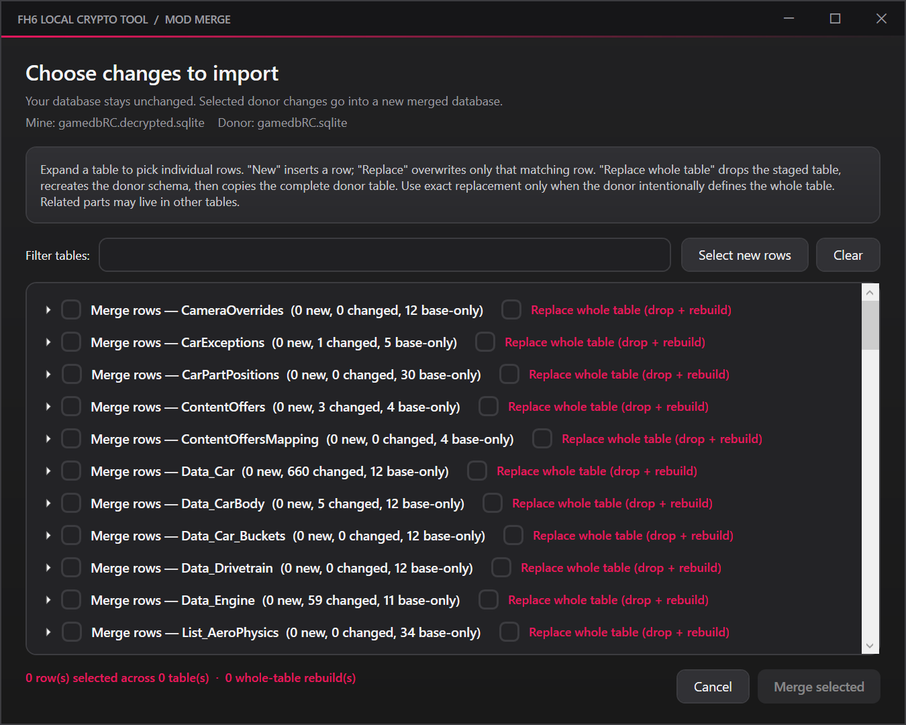

The staged database remains the base, and neither source file is overwritten. Whole-table rebuilds preserve the donor table definition, keys, row IDs, indexes, and triggers, then verify the copied contents and SQLite integrity. Keep backups: structurally valid rows can still be incompatible with another mod or game build.

### Merge an updated game database with your old modded database

This is a **separate** Crypto action; the general **Merge** picker and **Import car DB** keep their existing row-selection behavior and do not infer deletions. Put the clean GameDB from the new game update (`.slt` or `.sqlite`) in the **top** Crypto drop area. Put your **old modded full GameDB** in the smaller **lower merge** area, then click **Merge updated DB**. Review the matched baseline stamp and addition/edit/deletion counts, then confirm. The result is a new file in the top input's format; all sources and the clean reference stay untouched.

This is a **three-way comparison**: old clean baseline, old modded DB, new clean update. A baseline key missing from the modded DB is a deliberate deletion and is removed from the output, including engine/motor upgrade rows deleted for ICE/EV conversions. Rows added only by the official update are not mistaken for deletions. For keyed existing rows, only fields differing from the old baseline are copied, preserving official edits to untouched fields. User changes win when both sides edit the same field. A user-edited key removed by the official update is restored from the donor; review such conflicts before using the result. New user-added keys win collisions with update-added keys. The new update's `VersionInfo` stays unchanged.

Tables without keys, including car-part positions, use exact row content and multiplicity rather than trusting row IDs. Their old deleted content is removed and newly added content is copied. If the update independently changed the same keyless row, its new variant may remain alongside the modded variant; review the listed tables. Missing donor tables, incompatible column/key schemas and known sparse car exports block the update merge instead of risking mass deletion. New donor-only tables are supported; dropping an entire baseline table is not applied automatically. Structural/FK checks are safeguards, not a guarantee of in-game compatibility.

## Video guide

A video walkthrough is planned. Community-made guides are also welcome.

## Disclaimer

Forza Mod Tool is an unofficial project and is not affiliated with or endorsed by Microsoft, Xbox, Playground Games, or Turn 10 Studios. Keep backups and use modified files at your own risk.

## Credits

- JXRDN — Project creator, feature direction, UI design, research, and extensive in-game testing.
- Draff — Original Botan-based cryptography work, technical research, reference material, save-swap guidance, and now the newly added save editor.
- The Botan Project — Legacy crypto research/reference credit; this release uses managed .NET cryptography, not a bundled Botan binary.
- Smidge — Provided the reference database and schema examples that helped make additional upgrade options possible.
- Stalin — Identified and helped correct text-asset round-trip requirements
- Codex — Development assistance, debugging, automated round-trip testing, UI refinement, and documentation.
- DB Browser for SQLite (https://github.com/sqlitebrowser/sqlitebrowser) UI/workflow reference
- ForzaTechStudio (https://github.com/D3FEKT/ForzaTechStudio)
